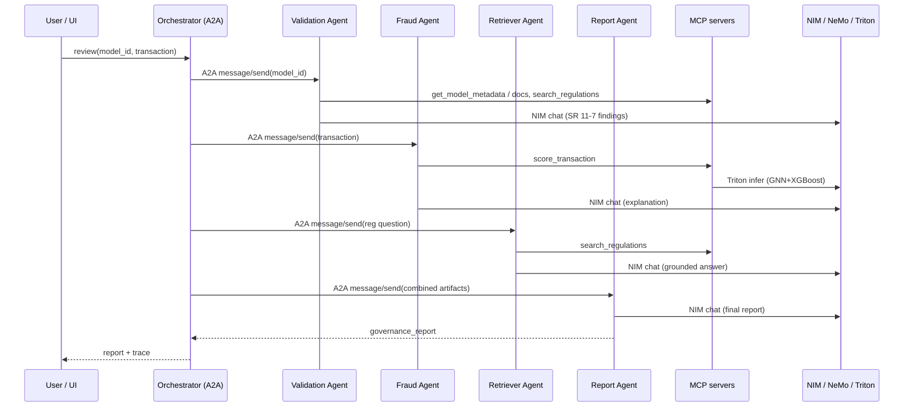
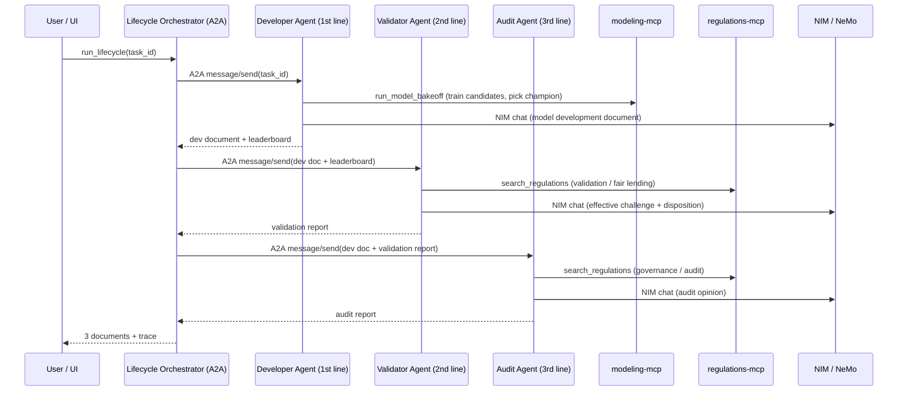

# Architecture

## Design goals
1. **Showcase the NVIDIA AI stack** as it would be deployed for a bank: NIM for
   LLM inference, NeMo Retriever for embeddings, Triton for the fraud model, on
   Kubernetes GPUs.
2. **Be a faithful agentic system**: real MCP tool servers and real A2A
   agent-to-agent messaging, not a monolith pretending to be agents.
3. **Always demoable**: laptop-friendly fallbacks so nothing hard-blocks a demo.

## Component responsibilities

### MCP tool servers (Model Context Protocol)
Tools are decoupled from agents. Any MCP client (our agents, Cursor, Claude
Desktop) can use them.

- **regulations-mcp** — `search_regulations`, `list_regulation_sources`.
  Semantic search over the banking-regulation corpus (NeMo Retriever embeddings
  → vector store; lexical fallback).
- **model-registry-mcp** — `list_models`, `get_model_metadata`,
  `get_model_documentation`. Stands in for a bank's MRM inventory.
- **fraud-mcp** — `score_transaction`. Proxies **Triton** (GNN+XGBoost) in the
  demo; heuristic locally.
- **modeling-mcp** — `list_tasks`, `list_candidate_models`, `run_model_bakeoff`,
  `get_champion`. Trains candidate models and selects a champion. scikit-learn
  locally; **RAPIDS cuML / XGBoost** analog on GPU.

### A2A agents (Agent-to-Agent protocol)
Each agent publishes an **Agent Card** at `/.well-known/agent-card.json` and
accepts JSON-RPC `message/send`. Each is independently deployable/scalable.

Governance-review flow:

- **retriever-agent** — grounds answers in retrieved regulations.
- **validation-agent** — SR 11-7 findings from model docs + regulations.
- **fraud-agent** — fraud score + analyst explanation + consumer-protection lens.
- **report-agent** — audit-ready governance report.
- **orchestrator** — A2A *client* that fans out to the specialists and composes
  the report; also an A2A *server* so it is itself composable.

Model-development lifecycle flow (three lines of defense):

- **developer-agent** (1st line) — runs the modeling-mcp bake-off, selects a
  champion against a documented primary metric, writes the model development
  document.
- **validator-agent** (2nd line) — independent *effective challenge*: critiques
  the champion selection (e.g. ROC-AUC vs PR-AUC/recall under class imbalance),
  reviews conceptual soundness, data, outcomes, and fair lending; issues a
  disposition (Approve / Approve with Conditions / Reject).
- **audit-agent** (3rd line) — audits the *process* (validation independence,
  documentation, effective-challenge evidence, approvals) and issues an audit
  opinion. Does not re-do the math.
- **lifecycle-orchestrator** — sequences developer → validator → audit, threading
  each artifact to the next agent; also an A2A server.

### Inference tier (NVIDIA, on GPU)
- **NIM (LLM)** — OpenAI-compatible chat completions used by every agent.
- **NeMo Retriever** — embedding NIM for RAG.
- **Triton** — serves the fraud GNN+XGBoost model (FIL/ONNX), dynamic batching,
  low-latency inference.

## Request flow (governance review)

## Request flow (model-development lifecycle)

## Local vs GPU parity

| Concern | Local dev | GKE GPU demo |
|---|---|---|
| LLM | OpenAI (`gpt-4o-mini`) | NIM (`llama-3.1-8b-instruct`) |
| Embeddings | OpenAI embeddings | NeMo Retriever (`nv-embedqa-e5-v5`) |
| Vector search | FAISS (CPU) / numpy | Milvus + cuVS (GPU) |
| Fraud model | heuristic | Triton (GNN+XGBoost) |
| Model bake-off | scikit-learn (CPU) | RAPIDS cuML / XGBoost (GPU) |
| Orchestration | same code | same code |

The agents/MCP servers are **identical** across environments; only config
(env vars in `ConfigMap`) changes. That portability is the core value: develop
locally against OpenAI, deploy on the NVIDIA stack with no code changes.

## Scaling & production notes
- Each agent/MCP server scales independently (HPA on CPU/RPS).
- NIM and Triton scale on the GPU pool; use separate GPU nodes or MIG slices to
  co-locate the 8B LLM, the embedder, and Triton cost-effectively.
- Add observability (OpenTelemetry traces across A2A hops), auth on the A2A
  endpoints, and per-tool rate limiting before real production.
