# Data Profile & Processing — Complaint→Regulation Classifier (CMPL-REG-24)

> Generated by `scripts/generate_complaint_data_profile.py` on 2026-07-23 21:44 UTC · Source: **CFPB Consumer Complaint Database** (public, PII-masked) · every number recomputed from `data/complaints/cfpb_complaints.csv`.

## 1 · Processing pipeline

```mermaid
flowchart LR
    A["CFPB bulk export
(public, PII-masked)"] --> B["Length filter
120-1,800 chars"]
    B --> C["Exact dedup
(normalized hash)"]
    C --> D["Near dedup
(fingerprint)"]
    D --> E["PII verification
(XXXX masking)"]
    E --> F["Balanced sampling
per-issue cap 350"]
    F --> G["Weak labeling
24 categories + non-reg"]
    G --> H["Scoring holdout
5% reserved first"]
    H --> I["Stratified split
80/10/10 train/val/test"]
```

| stage | what it does | parameter / evidence |
|---|---|---|
| 1 · Acquire | Two passes over the public CFPB Consumer Complaint Database: a generic slice of the narrative stream + a targeted pass over service-heavy issues (the non-regulatory pool), with a minority floor at assembly | scripts/fetch_cfpb_complaints.py · NONREG_TARGET=500 |
| 2 · Length filter | Keep narratives ≥ 120 chars; truncate at 1,800 chars | MIN_CHARS=120 · MAX_CHARS=1800 |
| 3 · Exact dedup | Hash of whitespace/case-normalized narrative | 0 duplicates remain (verified below) |
| 4 · Near dedup | First-200-chars normalized fingerprint (MinHash analog) | removes boilerplate template complaints |
| 5 · PII check | CFPB pre-masks PII as 'XXXX'; verified present, no raw PII added | 81% of narratives carry masking tokens |
| 6 · Balanced sampling | Per product-issue cap to fight credit-reporting skew | PER_ISSUE_CAP=350 · max observed 723 |
| 7 · Weak labeling | CFPB product/issue taxonomy + keyword rules → 24 categories + NON_REGULATORY | reg_agents/common/complaints.py |
| 8 · Scoring holdout | 5% stratified reserve carved out FIRST — the ingestion layer's unseen batch, never used in training/validation/test or threshold tuning | holdout 200 (175 / 25) |
| 9 · Split | 80/10/10 train/val/test on the remaining 95%, stratified on is_regulatory, fixed seed | train 3,040 / val 380 / test 380 |

At corpus scale each stage maps to a GPU-accelerated NeMo Data Curator module
(ScoreFilter, ExactDuplicates, FuzzyDuplicates, PiiModifier); at 4,000 rows the
pipeline runs on CPU in seconds.

## 2 · Dataset schema

| column | dtype | non-null | unique |
|---|---|---|---|
| complaint_id | int64 | 4,000 | 4,000 |
| date_received | object | 4,000 | 733 |
| product | object | 4,000 | 12 |
| sub_product | object | 4,000 | 35 |
| issue | object | 4,000 | 48 |
| sub_issue | object | 3,970 | 88 |
| company | object | 4,000 | 214 |
| state | object | 3,973 | 54 |
| tags | object | 673 | 3 |
| narrative | object | 4,000 | 4,000 |
| label | object | 4,000 | 23 |
| is_regulatory | int64 | 4,000 | 2 |

## 3 · Composition — regulatory vs non-regulatory

The dataset is NOT all-regulatory: 3,500 of 4,000 narratives (87.5%) carry a weak regulatory label and 500 (12.5%) are NON_REGULATORY service complaints. The raw CFPB stream is far more imbalanced (~3% non-regulatory), so acquisition runs a second, TARGETED pass over service-heavy issues ('Managing an account', 'Closing an account', ...) and enforces a non-regulatory floor at assembly time — giving the minority class enough support for stable threshold tuning and minority metrics while keeping every row a real CFPB complaint. The mix is still regulatory-dominated, which is why PR-AUC (not accuracy) is the primary stage-1 metric, why the classifiers use class weighting (class_weight='balanced'; scale_pos_weight), and why the score-distribution and calibration figures in the development document matter more than headline accuracy.

## 4 · Label coverage (weak labels, all 24 categories populated)

| label | regulation / category | n | share |
|---|---|---|---|
| REG_E_UNAUTHORIZED | Reg E / EFTA — Unauthorized Transfers | 1,091 | 27.3% |
| BSA_AML | BSA/AML — Account Freezes & Closures | 868 | 21.7% |
| NON_REGULATORY | Non-Regulatory — General Service | 500 | 12.5% |
| TISA_REG_DD | TISA / Reg DD — Deposit Account Disclosures | 315 | 7.9% |
| REG_CC_FUNDS | Reg CC — Funds Availability | 300 | 7.5% |
| FCRA_ACCURACY | FCRA — Accuracy of Reported Information | 239 | 6.0% |
| FCRA_PERMISSIBLE_PURPOSE | FCRA — Permissible Purpose / Improper Use | 149 | 3.7% |
| GLBA_PRIVACY | GLBA / Privacy — Information Sharing & Safeguards | 143 | 3.6% |
| ECOA_DISCRIMINATION | ECOA / Reg B — Credit Discrimination | 118 | 2.9% |
| FCRA_INVESTIGATION | FCRA — Reinvestigation of Disputes | 74 | 1.8% |
| SALES_PRACTICES | Sales Practices — Unauthorized Accounts/Products | 63 | 1.6% |
| FDCPA_DEBT_VALIDATION | FDCPA — Debt Validation / Not Owed | 34 | 0.9% |
| UDAAP | UDAAP — Unfair, Deceptive, or Abusive Acts | 26 | 0.7% |
| ECOA_ADVERSE_ACTION | ECOA / Reg B — Adverse Action Notices | 23 | 0.6% |
| RESPA_SERVICING | RESPA — Mortgage Servicing & Escrow | 12 | 0.3% |
| LOAN_SERVICING | Loan Servicing (Auto/Student/Personal) — UDAAP & Servicing Rules | 12 | 0.3% |
| REG_Z_DISCLOSURE | Reg Z / TILA — Fees, Interest & Disclosures | 11 | 0.3% |
| FDCPA_THREATS | FDCPA — False Statements or Threats | 7 | 0.2% |
| TILA_ORIGINATION | TILA — Credit Origination & Underwriting Disclosures | 5 | 0.1% |
| REG_Z_BILLING | Reg Z / FCBA — Billing Error Disputes | 5 | 0.1% |
| REG_E_ERROR_RESOLUTION | Reg E / EFTA — Error Resolution | 3 | 0.1% |
| FDCPA_COMMUNICATION | FDCPA — Communication Tactics | 1 | 0.0% |
| RESPA_LOSS_MITIGATION | RESPA — Loss Mitigation & Foreclosure | 1 | 0.0% |

## 5 · Narrative length

| statistic | value (chars) |
|---|---|
| mean | 986 |
| std | 560 |
| min / p25 / median / p75 / max | 120 / 493 / 874 / 1535 / 1800 |

## 6 · Scoring holdout + train / validation / test design

Before any modeling split, a stratified 5% SCORING HOLDOUT is reserved (fixed seed). It simulates a fresh batch arriving through the ingestion layer — scripts/score_batch.py and the UI's batch-scoring upload feed it through the two-stage pipeline and emit a scored CSV (complaint id, complaint, stage-1 score, LLM reasoning). No training, validation, test, or threshold-tuning step ever touches these rows.

Stage 1 then uses a stratified 80/10/10 train/validation/test split of the remaining 95% (fixed seed): the test set is split off first (10%), then the remainder is split 8/1 into train and validation. Champion selection happens on validation PR-AUC only, and the decision cut-off on P(regulatory) is optimized on the same validation fold (maximizing minority-class F1) instead of assuming the default 0.5. The test set is touched exactly once, to report final metrics for the already-selected, already-thresholded model — so neither model choice nor cut-off choice can leak into reported performance.

Stage 2 involves no training: it is a prompted LLM over retrieved context. Its evaluation uses a separate stratified sample (n=115) of regulatory complaints scored against the weak labels, reported in the validation report. No complaint text is used to fit stage-2 parameters.

| split | rows | regulatory | non-regulatory | regulatory rate |
|---|---|---|---|---|
| train | 3,040 | 2,660 | 380 | 87.50% |
| validation | 380 | 333 | 47 | 87.63% |
| test | 380 | 332 | 48 | 87.37% |
| scoring holdout (5% of full) | 200 | 175 | 25 | 87.50% |

## 7 · Data-quality checks (recomputed at generation time)

| check | result | expectation |
|---|---|---|
| rows | 4,000 | = TARGET_ROWS (4,000) |
| missing values (key columns) | 0 | complaint_id, product, issue, narrative |
| exact duplicate narratives | 0 | post-normalization |
| length bounds respected | min 120 · max 1800 | filter is 120–1,800 chars |
| PII masking present | 81.1% of narratives | CFPB 'XXXX' masking tokens |
| max complaints per product-issue | 723 | cap is 350 |
| label coverage | 23 of 24 categories | all categories populated |
| regulatory / non-regulatory | 3,500 / 500 | 87.5% regulatory |
