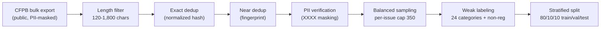
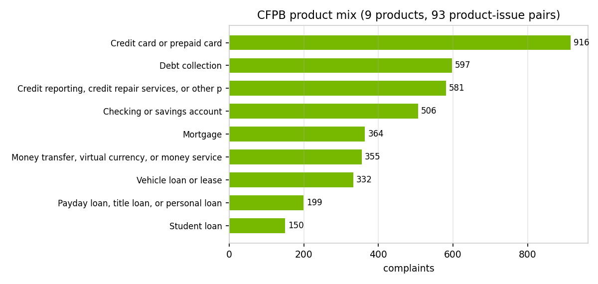
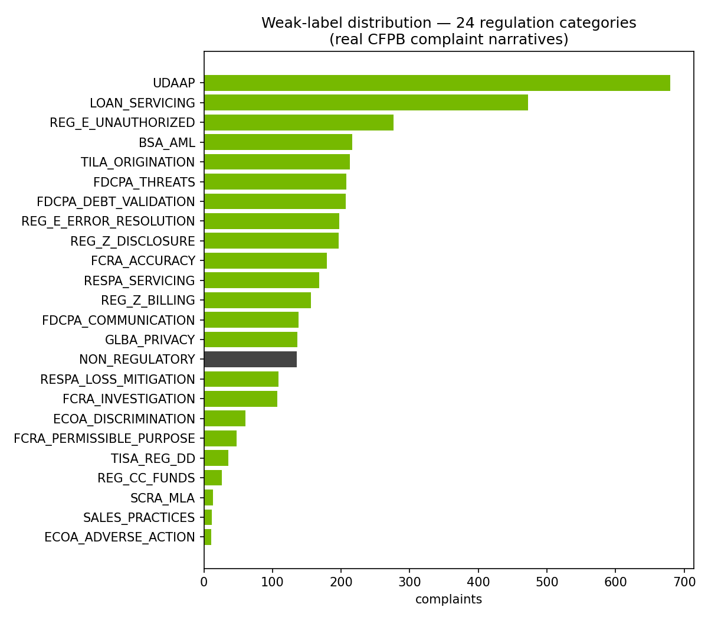
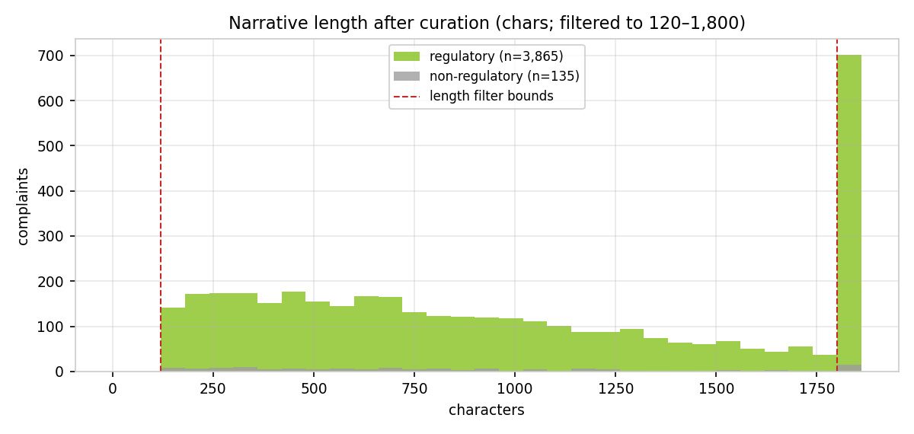
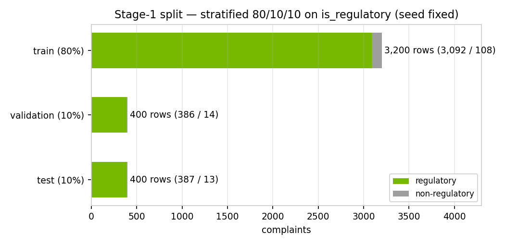

# Data Profile & Processing — Complaint→Regulation Classifier (CMPL-REG-24)

> Generated by `scripts/generate_complaint_data_profile.py` on 2026-07-22 02:57 UTC · Source: **CFPB Consumer Complaint Database** (public, PII-masked) · every number recomputed from `data/complaints/cfpb_complaints.csv`.

## 1 · Processing pipeline

| stage | what it does | parameter / evidence |
|---|---|---|
| 1 · Acquire | Download from the public CFPB Consumer Complaint Database (streaming parse of the bulk export) | scripts/fetch_cfpb_complaints.py |
| 2 · Length filter | Keep narratives ≥ 120 chars; truncate at 1,800 chars | MIN_CHARS=120 · MAX_CHARS=1800 |
| 3 · Exact dedup | Hash of whitespace/case-normalized narrative | 0 duplicates remain (verified below) |
| 4 · Near dedup | First-200-chars normalized fingerprint (MinHash analog) | removes boilerplate template complaints |
| 5 · PII check | CFPB pre-masks PII as 'XXXX'; verified present, no raw PII added | 82% of narratives carry masking tokens |
| 6 · Balanced sampling | Per product-issue cap to fight credit-reporting skew | PER_ISSUE_CAP=350 · max observed 126 |
| 7 · Weak labeling | CFPB product/issue taxonomy + keyword rules → 24 categories + NON_REGULATORY | reg_agents/common/complaints.py |
| 8 · Split | 80/10/10 train/val/test, stratified on is_regulatory, fixed seed | train 3,200 / val 400 / test 400 |

At corpus scale each stage maps to a GPU-accelerated NeMo Data Curator module
(ScoreFilter, ExactDuplicates, FuzzyDuplicates, PiiModifier); at 4,000 rows the
pipeline runs on CPU in seconds.

## 2 · Dataset schema

| column | dtype | non-null | unique |
|---|---|---|---|
| complaint_id | int64 | 4,000 | 4,000 |
| date_received | object | 4,000 | 67 |
| product | object | 4,000 | 9 |
| sub_product | object | 4,000 | 47 |
| issue | object | 4,000 | 73 |
| sub_issue | object | 2,970 | 146 |
| company | object | 4,000 | 557 |
| state | object | 3,986 | 56 |
| tags | object | 769 | 3 |
| narrative | object | 4,000 | 4,000 |
| label | object | 4,000 | 24 |
| is_regulatory | int64 | 4,000 | 2 |

## 3 · Composition — regulatory vs non-regulatory

The dataset is NOT all-regulatory: 3,865 of 4,000 narratives (96.6%) carry a weak regulatory label and 135 (3.4%) are NON_REGULATORY service complaints. The imbalance is a property of the source: the CFPB database predominantly receives complaints with a regulatory nexus, and the curation deliberately keeps the natural mix rather than rebalancing, so stage-1 metrics reflect production-like prevalence. This is why PR-AUC (not accuracy or ROC-AUC) is the primary stage-1 metric, why the classifiers use class weighting (class_weight='balanced'; scale_pos_weight), and why the score-distribution and calibration figures in the development document matter more than headline accuracy.

## 4 · Label coverage (weak labels, all 24 categories populated)

| label | regulation / category | n | share |
|---|---|---|---|
| UDAAP | UDAAP — Unfair, Deceptive, or Abusive Acts | 680 | 17.0% |
| LOAN_SERVICING | Loan Servicing (Auto/Student/Personal) — UDAAP & Servicing Rules | 472 | 11.8% |
| REG_E_UNAUTHORIZED | Reg E / EFTA — Unauthorized Transfers | 276 | 6.9% |
| BSA_AML | BSA/AML — Account Freezes & Closures | 216 | 5.4% |
| TILA_ORIGINATION | TILA — Credit Origination & Underwriting Disclosures | 213 | 5.3% |
| FDCPA_THREATS | FDCPA — False Statements or Threats | 208 | 5.2% |
| FDCPA_DEBT_VALIDATION | FDCPA — Debt Validation / Not Owed | 207 | 5.2% |
| REG_E_ERROR_RESOLUTION | Reg E / EFTA — Error Resolution | 197 | 4.9% |
| REG_Z_DISCLOSURE | Reg Z / TILA — Fees, Interest & Disclosures | 196 | 4.9% |
| FCRA_ACCURACY | FCRA — Accuracy of Reported Information | 179 | 4.5% |
| RESPA_SERVICING | RESPA — Mortgage Servicing & Escrow | 168 | 4.2% |
| REG_Z_BILLING | Reg Z / FCBA — Billing Error Disputes | 156 | 3.9% |
| FDCPA_COMMUNICATION | FDCPA — Communication Tactics | 138 | 3.5% |
| GLBA_PRIVACY | GLBA / Privacy — Information Sharing & Safeguards | 136 | 3.4% |
| NON_REGULATORY | Non-Regulatory — General Service | 135 | 3.4% |
| RESPA_LOSS_MITIGATION | RESPA — Loss Mitigation & Foreclosure | 109 | 2.7% |
| FCRA_INVESTIGATION | FCRA — Reinvestigation of Disputes | 107 | 2.7% |
| ECOA_DISCRIMINATION | ECOA / Reg B — Credit Discrimination | 61 | 1.5% |
| FCRA_PERMISSIBLE_PURPOSE | FCRA — Permissible Purpose / Improper Use | 48 | 1.2% |
| TISA_REG_DD | TISA / Reg DD — Deposit Account Disclosures | 36 | 0.9% |
| REG_CC_FUNDS | Reg CC — Funds Availability | 26 | 0.7% |
| SCRA_MLA | SCRA / MLA — Servicemember Protections | 13 | 0.3% |
| SALES_PRACTICES | Sales Practices — Unauthorized Accounts/Products | 12 | 0.3% |
| ECOA_ADVERSE_ACTION | ECOA / Reg B — Adverse Action Notices | 11 | 0.3% |

## 5 · Narrative length

| statistic | value (chars) |
|---|---|
| mean | 960 |
| std | 559 |
| min / p25 / median / p75 / max | 120 / 470 / 865 / 1482 / 1800 |

## 6 · Train / validation / test design

Stage 1 uses a stratified 80/10/10 train/validation/test split (fixed seed): the test set is split off first (10%), then the remainder is split 8/1 into train and validation. Champion selection happens on validation PR-AUC only, and the decision cut-off on P(regulatory) is optimized on the same validation fold (maximizing minority-class F1) instead of assuming the default 0.5. The test set is touched exactly once, to report final metrics for the already-selected, already-thresholded model — so neither model choice nor cut-off choice can leak into reported performance.

Stage 2 involves no training: it is a prompted LLM over retrieved context. Its evaluation uses a separate stratified sample (n=115) of regulatory complaints scored against the weak labels, reported in the validation report. No complaint text is used to fit stage-2 parameters.

| split | rows | regulatory | non-regulatory | regulatory rate |
|---|---|---|---|---|
| train | 3,200 | 3,092 | 108 | 96.62% |
| validation | 400 | 386 | 14 | 96.50% |
| test | 400 | 387 | 13 | 96.75% |

## 7 · Data-quality checks (recomputed at generation time)

| check | result | expectation |
|---|---|---|
| rows | 4,000 | = TARGET_ROWS (4,000) |
| missing values (key columns) | 0 | complaint_id, product, issue, narrative |
| exact duplicate narratives | 0 | post-normalization |
| length bounds respected | min 120 · max 1800 | filter is 120–1,800 chars |
| PII masking present | 82.3% of narratives | CFPB 'XXXX' masking tokens |
| max complaints per product-issue | 126 | cap is 350 |
| label coverage | 24 of 24 categories | all categories populated |
| regulatory / non-regulatory | 3,865 / 135 | 96.6% regulatory |
