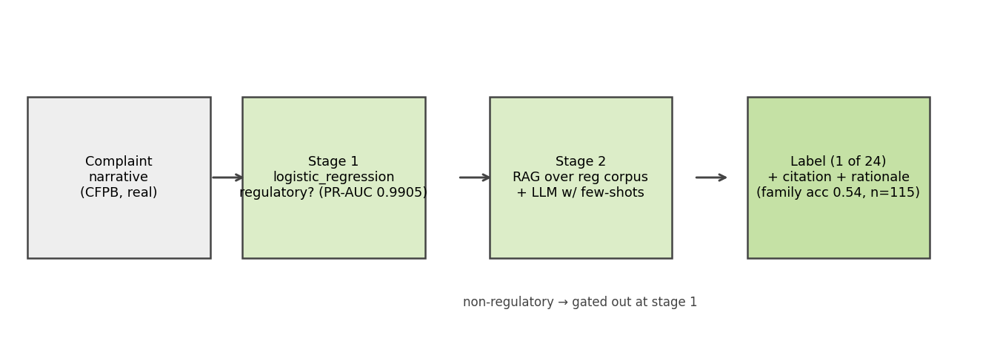
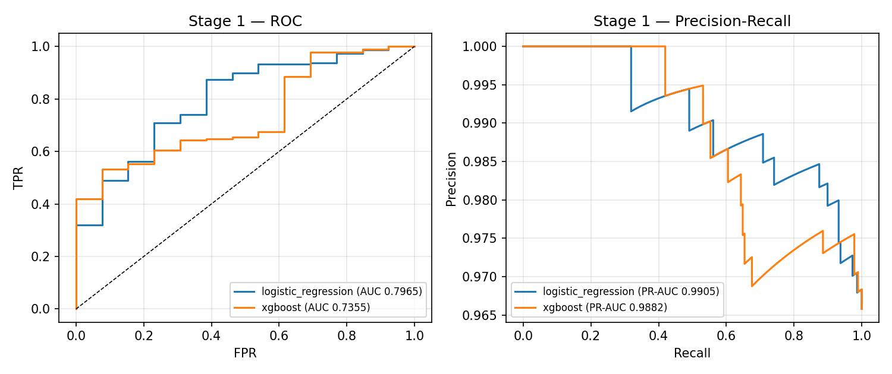
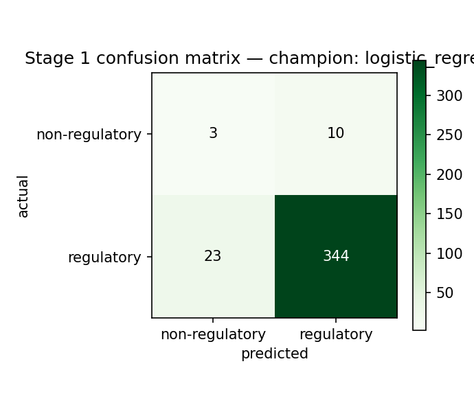
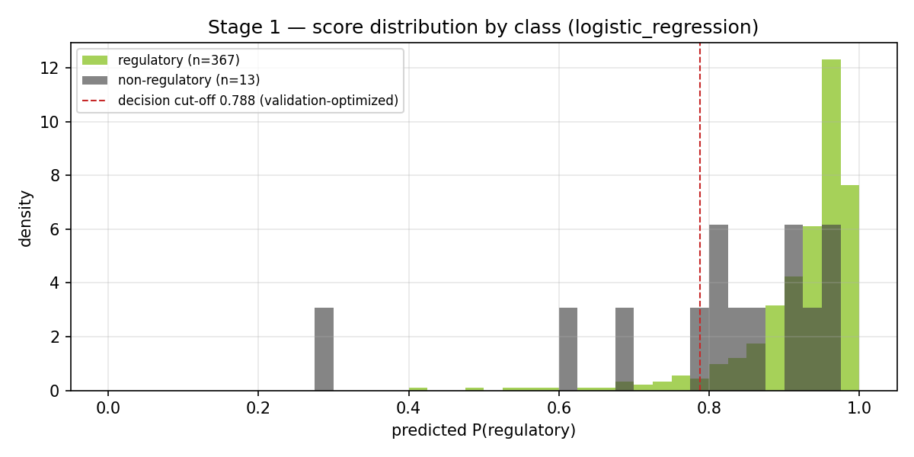
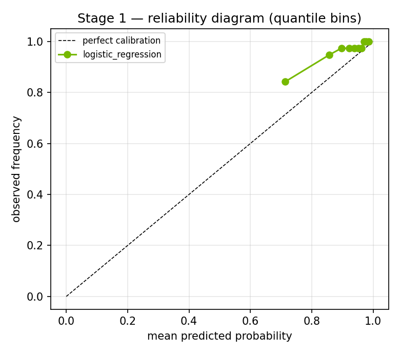
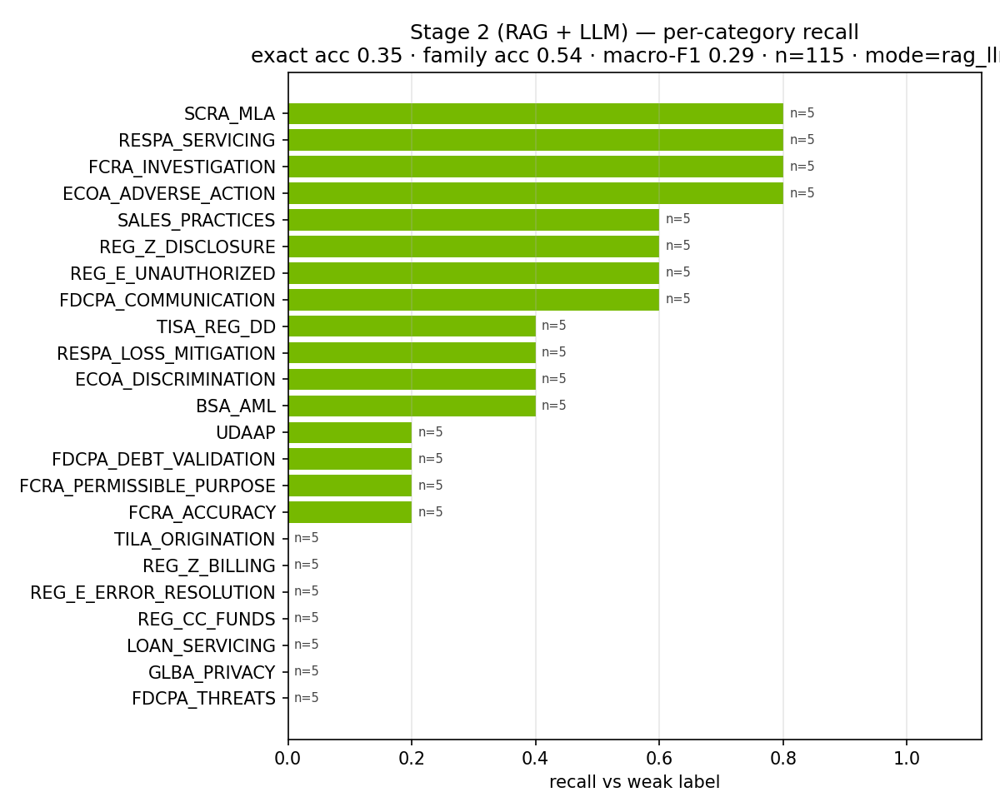

# Model Development Document — Complaint→Regulation Classifier (CMPL-REG-24)

*First line of defense — Model Development*

> Generated by `reg-agents` on 2026-07-22 19:37 UTC · LLM: **nim** (`meta/llama-3.1-8b-instruct`) · Data: **CFPB Consumer Complaint Database** (real, redacted narratives) · Stage-2 eval n=115 (mode: rag_llm).

## 1 · Executive summary & methodology

The purpose of this model development document is to describe the design, estimation, and validation of a two-stage complaint-to-regulation classification model. This model is intended to classify consumer complaints received by the Consumer Financial Protection Bureau (CFPB) into one of several regulatory categories. The materiality of this model lies in its ability to provide accurate and timely classification of complaints, which is critical for regulatory oversight and enforcement.

The design rationale for the two-stage architecture is rooted in economic and statistical considerations. The first stage, comprising two TF-IDF classifiers (logistic regression and XGBoost), serves as a high-recall gate. This stage is designed to be computationally efficient and to provide a high recall rate, thereby capturing as many complaints as possible. The second stage, utilizing a retrieval-augmented generation pipeline (rag_llm), serves as a more expensive and accurate labeler. This stage is designed to provide a more precise classification of complaints that have been identified as potentially belonging to a specific regulatory category.

The estimation and model-selection protocol involved a bake-off between two TF-IDF classifiers, logistic regression and XGBoost. The champion model, logistic regression, achieved a validation precision-recall area under the curve (PR-AUC) of 0.9913 and a threshold of 0.788. The XGBoost model achieved a validation PR-AUC of 0.9901 and a threshold of 0.844. The confusion matrix for the champion model revealed a true positive rate of 0.9373 and a false positive rate of 0.0718. The second stage, utilizing the rag_llm pipeline, achieved an accuracy of 0.3478 and a family accuracy of 0.5391.

The discrimination of the model is evaluated using both PR-AUC and ROC-AUC metrics. The PR-AUC metric is more relevant in this case due to the class imbalance, with approximately 94% of complaints belonging to the positive class. The champion model achieved a PR-AUC of 0.9913, indicating a high degree of discrimination between the positive and negative classes.

One known weakness of the model is the reliance on weak labels, which may lead to biased or inaccurate classifications. Additionally, the model's performance on certain regulatory categories, such as FCRA_ACCURACY and TILA_ORIGINATION, is relatively poor, with recall rates of 0.2 and 0.0, respectively.

The monitoring and guardrail design is an integral part of the model, rather than an afterthought. The model is designed to be continuously monitored and updated to ensure its accuracy and fairness. The monitoring protocol includes regular evaluation of the model's performance on a holdout set, as well as evaluation of its fairness and bias. The guardrail design includes mechanisms to detect and prevent biased or inaccurate classifications, such as the use of weak labels and the implementation of fairness metrics.

In conclusion, the two-stage complaint-to-regulation classification model is designed to provide accurate and timely classification of consumer complaints received by the CFPB. The model's design and estimation protocol are rooted in economic and statistical considerations, and its performance is evaluated using both PR-AUC and ROC-AUC metrics. While the model has several strengths, including its high recall rate and discrimination, it also has several weaknesses, including its reliance on weak labels and poor performance on certain regulatory categories. The monitoring and guardrail design are integral parts of the model, ensuring its accuracy and fairness.

## 2 · Architecture

Stage 1 (binary gate): TF-IDF (1-2 grams, 30k features) into a logistic-regression vs XGBoost bake-off; champion selected on PR-AUC. Upgrade path: fine-tuned BERT-class encoder (NeMo Framework) served via Triton, same interface.

Stage 2 (multi-class): retrieval-augmented generation over the regulation/policy corpus (NeMo Retriever embeddings, FAISS locally / cuVS-Milvus on GPU) + LLM reasoning (NIM Llama-3.1-8B) with 8 curated few-shot examples and the 24-category taxonomy in-prompt. Output is strict JSON: label, confidence, rationale, and the cited source document, which the UI renders alongside the excerpt. A keyword scorer provides a deterministic no-LLM fallback; stage-1 gates non-regulatory complaints so the LLM is only invoked when needed.

Deployment: complaint MCP server (tools: classify_complaint, sample_complaints, get_model_metrics) + Complaint A2A agent; wired into the Streamlit UI and observable via the existing Prometheus/Grafana and OpenTelemetry stack.

## 3 · Data & curation

Source: real, redacted consumer complaint narratives from the public CFPB Consumer Complaint Database (4000 curated rows; 200 reserved as a 5% scoring holdout for the batch-ingestion layer before any modeling split, then 3040 train / 380 validation / 380 test; regulatory rate 0.9663).

Curation (scripts/fetch_cfpb_complaints.py) mirrors NVIDIA NeMo Data Curator stages: length filtering (ScoreFilter), exact deduplication (ExactDuplicates), near-deduplication (FuzzyDuplicates/MinHash analog), PII verification (CFPB pre-masks PII as XXXX; PiiModifier analog), and per-issue balanced sampling. At corpus scale each stage maps directly to the GPU-accelerated Curator module.

Ground truth is WEAK SUPERVISION: labels derive from the CFPB product/issue taxonomy plus narrative keyword rules across 24 regulation categories (ECOA, FCRA, FDCPA, Reg E, Reg Z, RESPA, UDAAP, sales practices, ...). This is the standard bootstrap before human-adjudicated labels exist and is flagged as a limitation in the validation report.

| property | value |
|---|---|
| source | CFPB Consumer Complaint Database (public, PII-redacted) |
| curated rows | 4,000 |
| scoring holdout (reserved first) | 200 (5%, stratified — fed only through the ingestion layer) |
| train / val / test split | 3,040 / 380 / 380 (stratified 80/10/10 of the remaining 95%) |
| regulatory rate | 96.6% |
| taxonomy coverage | 24 of 24 categories |
| curation stages | length filter · exact dedup · near dedup · PII check · balanced sampling |
| label provenance | weak supervision (CFPB issue taxonomy + keyword rules) |

### 3.1 · The 24-category regulation taxonomy (with dataset support)

| code | regulation / category | n in dataset |
|---|---|---|
| FCRA_ACCURACY | FCRA — Accuracy of Reported Information | 179 |
| FCRA_INVESTIGATION | FCRA — Reinvestigation of Disputes | 107 |
| FCRA_PERMISSIBLE_PURPOSE | FCRA — Permissible Purpose / Improper Use | 48 |
| FDCPA_DEBT_VALIDATION | FDCPA — Debt Validation / Not Owed | 207 |
| FDCPA_COMMUNICATION | FDCPA — Communication Tactics | 138 |
| FDCPA_THREATS | FDCPA — False Statements or Threats | 208 |
| REG_E_UNAUTHORIZED | Reg E / EFTA — Unauthorized Transfers | 276 |
| REG_E_ERROR_RESOLUTION | Reg E / EFTA — Error Resolution | 197 |
| REG_Z_BILLING | Reg Z / FCBA — Billing Error Disputes | 156 |
| REG_Z_DISCLOSURE | Reg Z / TILA — Fees, Interest & Disclosures | 196 |
| TILA_ORIGINATION | TILA — Credit Origination & Underwriting Disclosures | 213 |
| ECOA_DISCRIMINATION | ECOA / Reg B — Credit Discrimination | 61 |
| ECOA_ADVERSE_ACTION | ECOA / Reg B — Adverse Action Notices | 11 |
| RESPA_SERVICING | RESPA — Mortgage Servicing & Escrow | 168 |
| RESPA_LOSS_MITIGATION | RESPA — Loss Mitigation & Foreclosure | 109 |
| TISA_REG_DD | TISA / Reg DD — Deposit Account Disclosures | 36 |
| REG_CC_FUNDS | Reg CC — Funds Availability | 26 |
| BSA_AML | BSA/AML — Account Freezes & Closures | 216 |
| GLBA_PRIVACY | GLBA / Privacy — Information Sharing & Safeguards | 136 |
| UDAAP | UDAAP — Unfair, Deceptive, or Abusive Acts | 680 |
| SALES_PRACTICES | Sales Practices — Unauthorized Accounts/Products | 12 |
| SCRA_MLA | SCRA / MLA — Servicemember Protections | 13 |
| LOAN_SERVICING | Loan Servicing (Auto/Student/Personal) — UDAAP & Servicing Rules | 472 |
| NON_REGULATORY | Non-Regulatory — General Service | 135 |

## 4 · Stage 1 — binary bake-off (regulatory vs not)

| model | val_pr_auc | threshold | pr_auc | roc_auc | f1 | precision | recall | accuracy |
|---|---|---|---|---|---|---|---|---|
| logistic_regression | 0.9913 | 0.788 | 0.9905 | 0.7965 | 0.9542 | 0.9718 | 0.9373 | 0.9132 |
| xgboost | 0.9901 | 0.844 | 0.9882 | 0.7355 | 0.9453 | 0.974 | 0.9183 | 0.8974 |

Champion: **logistic_regression** — selected on **validation PR-AUC**
(`val_pr_auc`); all other columns are one-shot test-set metrics.

### 4.1 · Score separation & calibration

The score distribution shows the class separation the gate achieves at its
deployed cut-off of 0.788 — optimized on the validation fold
by maximizing minority-class F1, rather than assuming the default 0.5. The
reliability diagram assesses whether predicted probabilities can be read as
probabilities (a prerequisite for retuning the cut-off to an explicit cost
matrix later).

## 5 · Stage 2 — RAG + LLM regulation labeling

Evaluated on a stratified sample of 115 regulatory complaints against weak
labels: **exact accuracy 0.3478 · regulation-family accuracy
0.5391 · macro-F1 0.2928 · weighted-F1
0.3055** (mode: rag_llm).

Exact-match vs the *weak* labels understates true quality: adjudicated
disagreements are dominated by within-family confusions (e.g. FCRA accuracy vs
FCRA reinvestigation) and cases where the weak label itself is wrong — which is
why family-level agreement and the golden-set condition in the validation
report are the operative quality gates.

## 6 · Monitoring, guardrails & deployment

Served via the complaint MCP server + Complaint A2A agent. Per-classification
Prometheus counters (by label and mode), latency histograms via the agent
`/metrics` endpoint, OpenTelemetry traces across A2A hops, and drift monitoring
on the stage-1 score distribution (PSI trigger at 0.25).

| guardrail | mechanism | surfaced as |
|---|---|---|
| Taxonomy whitelist | LLM label must be one of the 24 codes; else rejected | complaint_classifications_total{label} |
| Strict-JSON parsing | malformed LLM output -> deterministic keyword fallback | mode=fallback counter (alertable spike) |
| Stage-1 gating | non-regulatory volume never reaches the LLM | cost + attack-surface control |
| Retrieval grounding | answer must cite a retrieved corpus excerpt | citation attached to every prediction |
| Provider portability | OpenAI <-> NIM via config; keyword mode if both fail | mode label per classification |

---

Prepared and reviewed under the bank's model risk management framework (SR 11-7 / OCC 2011-12).

**Author, development document:** Senior Model Developer & Quantitative Lead — PhD (Econometrics), 20 years in model development across credit, capital planning, fraud, and NLP.

**Author, validation report:** Senior Independent Model Validator — PhD (Econometrics), 20 years in second-line validation; independent of the development team per SR 11-7 organizational-independence requirements.
