# End-to-End Model Development Document — CMPL-REG-24

**Complaint → Regulation Classifier**
**Two-stage gate · RAG/LLM labeling · Leakage audit · Dual-judge panel · DPO/RLAIF**

> Generated by `scripts/generate_e2e_model_development_doc.py` on 2026-08-04 03:47 UTC.
> Figures and tables are drawn from committed artifacts under
> `docs/complaint_model/` and `docs/model_development/`. This document is the
> narrative governance record; machine-readable metrics remain in the JSON
> companions cited in §14.

## Abstract

This Model Development Document presents the complete development, validation, and governance record for CMPL-REG-24, a two-stage classifier that decides whether a consumer complaint implicates a consumer-protection regulation and, when it does, assigns one of twenty-four regulation categories with a citable rationale. The work rests on 4,000 curated narratives from the public CFPB Consumer Complaint Database (87.5% regulatory / 12.5% non-regulatory after stratified acquisition). The production stage-1 gate is an L1-regularized logistic regression (l1, C=4.0) deployed at a validation-tuned cut-off of 0.491, delivering test ROC-AUC 0.9362, PR-AUC 0.9904, and a monitored train/test gap of 0.0601. Stage 2 combines retrieval over the regulation corpus with NIM or OpenAI generation under a taxonomy whitelist. The document further records a formal leakage audit, a dual-judge evaluation panel in which NVIDIA NIM and OpenAI act as independent first-class judges (not fallbacks), and a DPO/RLAIF post-training loop that produces a challenger policy without promoting it ahead of human adjudication. Disposition under an SR 11-7 framing is Approve with Conditions.

## 1 · Purpose, risk tier, and the discipline this document enforces

For more than three decades of building and reviewing credit, fraud, AML, and consumer-conduct models, one lesson has remained constant: architecture is rarely the hard part. The hard part is deciding what the model is for, what it is allowed to get wrong, and how the institution will know when the story it tells itself about performance has become fiction. CMPL-REG-24 was developed with that discipline in mind.

The business problem is straightforward and unforgiving. Consumer complaints arrive as free text. A minority are routine service friction. The majority, in this corpus, implicate a specific consumer-protection regime—FCRA, FDCPA, Regulation E, Regulation Z, RESPA, ECOA, UDAAP, and related authorities. Routing every narrative through a large language model is financially wasteful and operationally noisy. Routing none of them through a grounded labeler leaves the bank blind to regulatory exposure. The correct design is therefore staged: a cheap, high-recall gate that answers only whether a regulatory nexus exists, followed by a retrieval-augmented labeler that names the regulation and cites the passage that supports the call.

We treat this as a Tier-2 (medium) model under an SR 11-7-aligned three-lines framing. A false negative at stage 1 delays a regulatory complaint into an ordinary service queue—the costlier error for the institution. A false positive costs one unnecessary LLM call. That asymmetry drives every subsequent choice: class weighting, the selection metric, the refusal to accept a default 0.5 cut-off, and the insistence that stage-2 agreement with weak labels never be mistaken for adjudicated accuracy.

This document is the end-to-end record. It covers data acquisition and its measured version history; the split protocol including a five-percent scoring holdout reserved before any modeling; stage-1 estimation, regularization, and selection; a leakage audit that distinguishes split contamination from weak-supervision target leakage; stage-2 RAG and LLM labeling; a dual-judge panel with NVIDIA NIM and OpenAI as independent evaluators; a DPO/RLAIF post-training loop that produces a challenger rather than a silent replacement; batch ingestion; and the MCP/A2A serving path on which the model runs in the agentic stack.

## 2 · End-to-end architecture

The production path is deliberately boring in the places where boredom is a virtue, and expressive only where citation and judgment require it.

Inbound text arrives either as a live complaint or as a batch file through the ingestion layer. Before any model is fit, five percent of the curated corpus is carved out as a stratified scoring holdout. That holdout never participates in training, validation, threshold tuning, or champion selection. It exists so that the institution can demonstrate, on demand, what the pipeline does to a fresh batch—the same motion a scheduler or an operations analyst would trigger in production.

Of the remaining ninety-five percent, a stratified eighty/ten/ten split defines train, validation, and test. Stage 1, a TF-IDF logistic gate in production, emits a probability of regulatory nexus and applies a cut-off chosen on the validation fold. Narratives that clear the gate proceed to stage 2: dense retrieval over the regulation and policy corpus, followed by an LLM that must return a label inside a twenty-four-category whitelist together with a short rationale and a citation excerpt. Narratives that fail the gate are disposed as non-regulatory without an LLM call.

Two evaluation overlays sit beside this path and do not replace it. The first is a dual-judge panel in which NIM and OpenAI each answer the stage-1 question independently; their disagreements with the gate form the human-adjudication queue. The second is a DPO/RLAIF challenger policy trained on preference pairs derived from judge consensus on the validation fold—never on the test fold. Both overlays exist to keep the institution honest about where the gate and the weak labels may both be wrong.

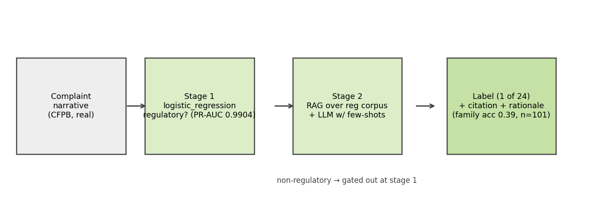

*Figure 1. Two-stage complaint pipeline: ingestion and scoring holdout, stage-1 regulatory gate, stage-2 RAG and LLM labeling with citations.*

## 3 · Data: acquisition, curation, and why the version log matters more than the architecture

The corpus is real public data: PII-redacted consumer narratives from the CFPB Consumer Complaint Database. After curation we retain 4,000 rows. Labels are weak supervision—derived from the Bureau's product and issue taxonomy, with a small set of narrative keyword overrides for regimes the taxonomy under-represents (ECOA, SCRA/MLA, GLBA, sales practices, BSA/AML). Weak labels are a starting point for model development, not a substitute for adjudicated truth. Anyone who has lived through a regulatory examination knows the difference; this document does not blur it.

Curation follows stages that a NeMo Data Curator practitioner would recognize: length filtering between 120 and 1,800 characters, exact-hash deduplication, 200-character prefix near-deduplication, TF-IDF-cosine fuzzy deduplication at similarity 0.9 or above, PII-mask verification, and per-issue balanced sampling to fight the credit-reporting skew that otherwise overwhelms every other category. The fuzzy-dedup pass was not decorative. It was the response to a leakage finding, discussed below.

Class balance is the hinge on which stage 1 turns. A natural pull of the CFPB narrative stream yields only about three percent non-regulatory examples—far too few to estimate a decision cut-off or to trust minority metrics. We therefore engineered a two-pass acquisition strategy: a generic slice of the stream, plus a targeted second pass over service-heavy issues (account management, opening and closing, customer service), with a hard floor of 500 non-regulatory rows at assembly. The resulting mix is 87.5% regulatory and 12.5% non-regulatory. That is still imbalanced by any ordinary standard, but it is estimable. In this line of work, estimable beats theoretically pure.

The measured impact of the data work is the most important table in the document. Moving from a generic-only pull (v1) to targeted acquisition (v2) lifted test ROC-AUC from 0.849 to 0.945 and collapsed the train/test gap from 0.147 to 0.031—with no change to the model family. The subsequent cosine fuzzy-dedup pass (v3) then lowered the headline from 0.945 to 0.936 and reopened the gap slightly to 0.060, because roughly four and a half percent of test rows had been near-copies of training rows that the prefix signature could not see. The lower number is the honest number. Institutions that celebrate the higher one are celebrating contamination.

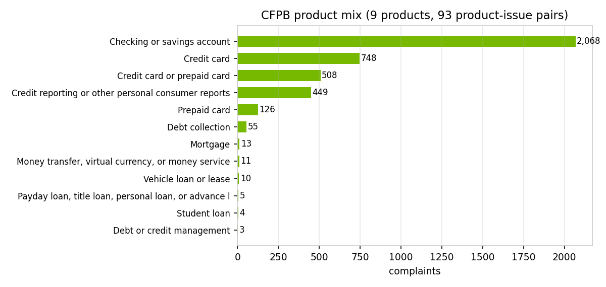

*Figure 2. Product mix after curation. Credit-reporting volume is controlled by per-issue caps; the service-heavy pass supplies the non-regulatory minority.*

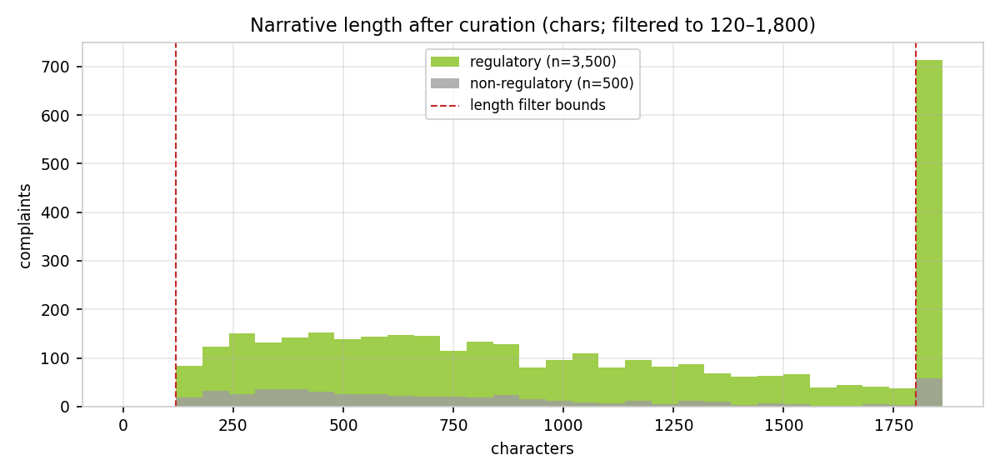

*Figure 3. Narrative length distribution. Non-regulatory complaints skew shorter; length alone is weakly informative and is never used as a feature.*

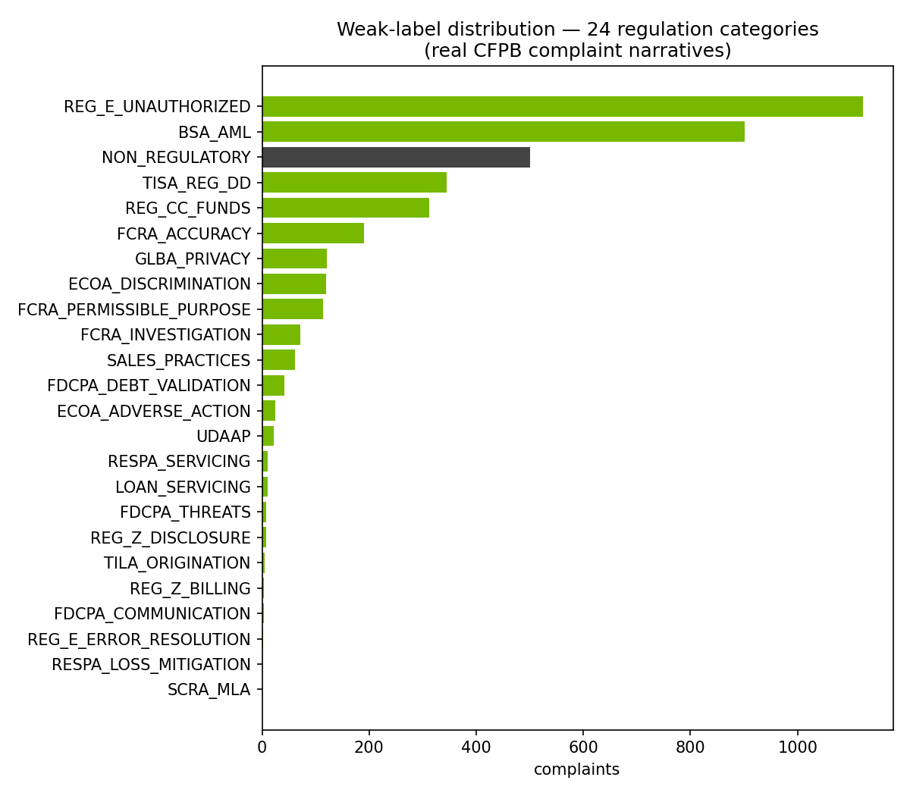

*Figure 4. Weak-label distribution across the twenty-four-category taxonomy, including NON_REGULATORY.*

### Table 1 — Dataset version log (measured impact on the stage-1 champion)

| dataset version | non-regulatory | val cut-off | test ROC-AUC | train/test gap |
|---|---|---|---|---|
| v1 generic pull | 135 (3.4%) | 0.639 | 0.849 | 0.147 |
| v2 + targeted service pass | 500 (12.5%) | 0.397 | 0.945 | 0.031 |
| v3 + cosine fuzzy dedup | 500 (12.5%) | 0.491 | 0.936 | 0.060 |
| v1 to v3 net | +365 minority | — | +0.087 | −0.087 |

Split design is where many otherwise careful programs quietly fail. We reserve the scoring holdout first, then split the remainder. The order matters. A holdout drawn after model selection is not a holdout; it is a rumor. Seed forty-two fixes membership so that every regeneration of this document, every unit test, and every batch-scoring demonstration sees the same rows in the same role.

Validation is the only fold that may see threshold search, regularization search, and champion selection. The test fold is opened once, for the numbers this document quotes. That rule is older than gradient boosting, and it has not become optional because models became fashionable.

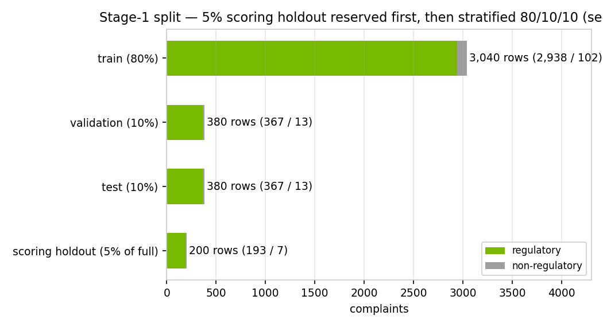

*Figure 5. Scoring holdout (5%) reserved first; stratified 80/10/10 on the remainder.*

### Table 2 — Split membership

| split | n | regulatory | non-regulatory | reg rate |
|---|---|---|---|---|
| train (80%) | 3,040 | 2,660 | 380 | 87.50% |
| validation (10%) | 380 | 333 | 47 | 87.63% |
| test (10%) | 380 | 332 | 48 | 87.37% |
| scoring holdout (5% of full) | 200 | 175 | 25 | 87.50% |

## 4 · Stage 1 — the regulatory gate

Stage 1 answers a single question: does this narrative have a regulatory nexus? Features are character-aware only through TF-IDF—thirty thousand unigrams and bigrams, sublinear term frequency, minimum document frequency of two—fit exclusively on the training fold. The vectorizer never sees validation or test text at fit time. Class imbalance is handled with balanced class weights for the linear model and scale_pos_weight for tree models; DistilBERT, when studied, uses class-weighted cross-entropy.

We compared candidates rather than declaring a favorite in advance. The production bake-off fits a regularization-tuned logistic regression and an XGBoost challenger. The publication-grade research document additionally reports LightGBM and a fine-tuned DistilBERT. Selection for production uses validation PR-AUC; the research document also tracks minority PR-AUC, which is the harder and more informative lens when the minority class is the operational target of the gate. In both tracks, each candidate receives its own validation-optimized cut-off that maximizes minority-class F1. The industry habit of shipping at 0.5 is a habit, not a method.

The production champion is logistic regression with L1 penalty and C equal to 4.0, cut off at 0.491. On the held-out test fold it records PR-AUC 0.9904, ROC-AUC 0.9362, F1 0.9401, precision 0.9592, and recall 0.9217, with a train/test ROC gap of 0.0601. Those are strong numbers on a regulatory-dominated problem; they are not an invitation to stop watching the gap.

Regularization earned its keep. An under-penalized linear model on a thirty-thousand-dimensional sparse space will memorize. We observed train ROC near 1.0 against a materially weaker test ROC—a generalization gap on the order of 0.20. A validation grid over L1 and L2 penalties and C in {0.5, 1.0, 2.0, 4.0} selected L1 at C=4.0, which sparsifies the n-gram weights and brings the gap down to the monitored neighborhood of 0.06. L1 is not romantic; it is the right tool when most features should be silent.

The research bake-off's validation-minority champion is lightgbm at cut-off 0.992, with test ROC-AUC close to the logistic gate. We do not promote it to production. Millisecond CPU inference, coefficient-level inspectability, and the absence of a meaningful lift outside the seed-stability band keep the linear model in the chair. Complexity that does not buy a governed improvement is not sophistication; it is inventory.

### Table 3 — Production stage-1 leaderboard

| model | params | thr | PR-AUC | ROC-AUC | gap | F1 | prec | recall |
|---|---|---|---|---|---|---|---|---|
| logreg | l1, C=4.0 | 0.491 | 0.9904 | 0.9362 | 0.0601 | 0.9401 | 0.9592 | 0.9217 |
| xgboost | n=300, d=6, lr=.1 | 0.545 | 0.9843 | 0.9073 | 0.0927 | 0.9412 | 0.9426 | 0.9398 |

### Table 4 — Research bake-off on held-out test (publication MDD)

| model | thr | PR-AUC (min) | ROC-AUC | F1 (min) | balanced acc |
|---|---|---|---|---|---|
| logreg | 0.491 | 0.6707 | 0.9362 | 0.6422 | 0.8254 |
| xgboost | 0.545 | 0.6234 | 0.9073 | 0.5979 | 0.772 |
| lightgbm | 0.992 | 0.6908 | 0.9367 | 0.6261 | 0.8283 |
| distilbert | 0.478 | 0.6116 | 0.9317 | 0.5854 | 0.8163 |

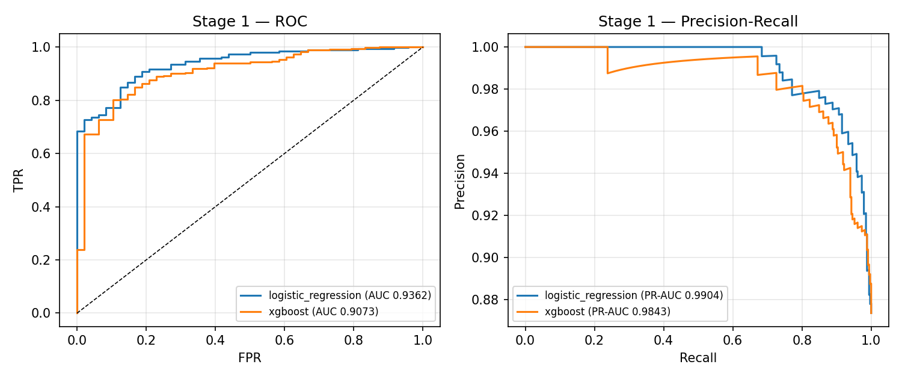

*Figure 6. Production stage-1 ROC and precision-recall curves on the held-out test fold.*


*Figure 7. Research bake-off comparison across logistic regression, XGBoost, LightGBM, and DistilBERT.*


*Figure 8. Research MDD test-fold ROC and minority PR curves for all candidates.*

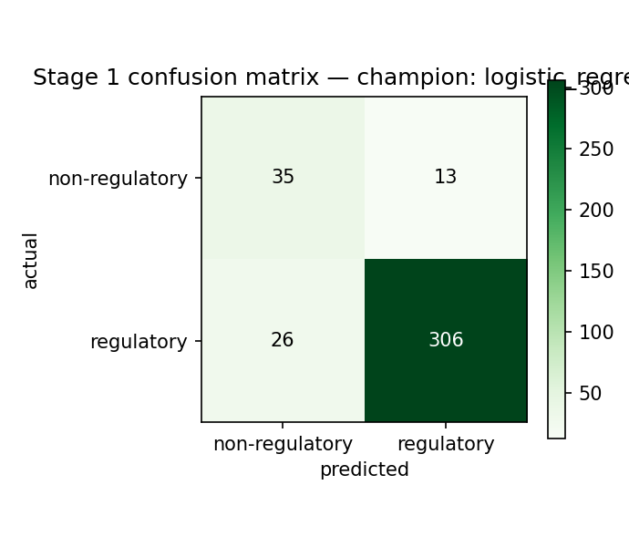

*Figure 9. Production gate confusion matrix at the validation-tuned cut-off.*

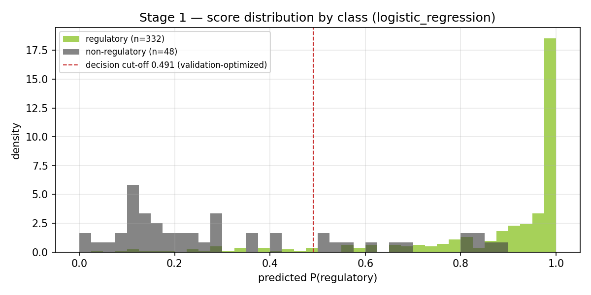

*Figure 10. Stage-1 score distribution by class — the cut-off is visible as an operating choice, not a default.*

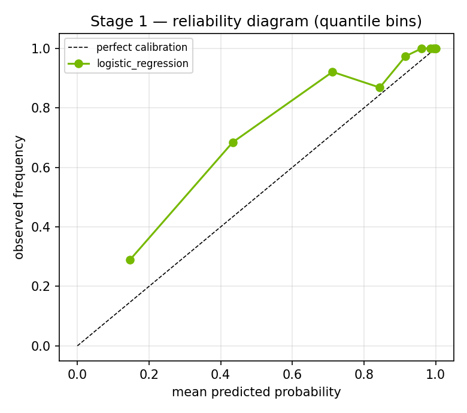

*Figure 11. Reliability / calibration view for the production gate.*

## 5 · Leakage audit — contamination and weak-supervision target leakage

Leakage is the quiet way a model development program loses its reputation. We audit two distinct vectors, and we keep both in the test suite so that regeneration cannot quietly reintroduce either.

The first vector is split contamination: exact or near-duplicate narratives shared between train and test. Exact hashes and 200-character prefixes caught the obvious copies. They did not catch template complaints whose openings differ—the credit-report dispute that begins with a different salutation and then follows a shared script. A blockwise TF-IDF-cosine filter at similarity 0.9 or above removed those near-copies at curation time. The post-split audit now reports zero exact duplicates, zero prefix near-duplicates, and a cosine near-duplicate count inside a one-percent-of-test tolerance (currently 2 rows). The unit test fails the build if that contract breaks.

The second vector is target leakage through weak supervision. Approximately 75% of labels are decided by regular expressions on the narrative itself. In those rows, the labeling rule is literally inside the model's input. Headline agreement on that slice partly measures the model re-learning its own labeler. That is not criminal, but it is not generalization. We therefore compute label provenance with label_source() and report a leakage-free evaluation slice: rows whose labels come only from the CFPB issue field, metadata the model never sees. On that near-balanced slice the honest ROC-AUC sits near 0.91 in the research audit and 0.8876 for the production gate in the DPO comparison. When an examiner or a partner asks how well the gate generalizes beyond its heuristics, that is the number to quote—not the headline on the full test fold.

### Table 5 — Split contamination checks (test versus train)

| check | count | expected | status |
|---|---|---|---|
| exact duplicate (normalized hash) | 0 | 0 | pass |
| near-duplicate (200-char prefix) | 0 | 0 | pass |
| near-duplicate (TF-IDF cosine ≥ 0.9) | 2 | ≤ 1% of test | pass |

### Table 6 — Evaluation slices (headline versus leakage-free)

| test slice | n | reg-rate | ROC-AUC | PR-AUC | F1 (min) | balanced acc |
|---|---|---|---|---|---|---|
| full test set (headline) | 380 | 0.87 | 0.937 | 0.990 | 0.626 | 0.828 |
| metadata-labeled (leakage-free) | 81 | 0.41 | 0.907 | 0.895 | 0.818 | 0.814 |
| narrative-regex-labeled | 299 | 1.00 | — (single class: regulatory by construction) | — | — | — |

## 6 · Stage 2 — retrieval-augmented regulation labeling

Stage 2 exists because a binary gate, however well calibrated, does not tell an investigator which regulation is in play or why. Only narratives that clear stage 1 enter retrieval. The retriever is FAISS in the local path and NeMo Retriever embeddings on the NVIDIA path. The generator is NIM or OpenAI according to the pipeline's LLM_PROVIDER setting. The output contract is strict: one label from the twenty-four-category taxonomy, a confidence, a one-paragraph rationale, and a citation drawn from the retrieved excerpts. Labels outside the whitelist are rejected. A deterministic keyword scorer remains available as an offline path when no LLM is configured; it is not a substitute for the dual-judge panel, and it is not how we evaluate stage 1.

Against weak labels on a stratified sample of 101 gated-in complaints, exact agreement is 0.25 and family-level agreement is 0.39, with macro-F1 0.25. Those figures will disappoint anyone who expected LLM labeling to look like a Kaggle leaderboard. They should not disappoint a practitioner. The reference is noisy; disagreements concentrate inside families—FCRA accuracy versus FCRA reinvestigation, for example—where even human annotators argue. The service-heavy minority mix we deliberately acquired makes the task harder than an earlier, credit-reporting-dominated slice. The correct institutional response is not to hide the number. It is to fund a golden set and to read family-level agreement as the operationally relevant ceiling until that set exists.

### Table 7 — Stage-2 per-label recall (top ten by recall)

| label | support | recall |
|---|---|---|
| RESPA_LOSS_MITIGATION | 1 | 1.00 |
| SALES_PRACTICES | 5 | 1.00 |
| SCRA_MLA | 1 | 1.00 |
| BSA_AML | 5 | 0.60 |
| FCRA_ACCURACY | 5 | 0.60 |
| FCRA_PERMISSIBLE_PURPOSE | 5 | 0.40 |
| FDCPA_DEBT_VALIDATION | 5 | 0.40 |
| REG_E_UNAUTHORIZED | 5 | 0.40 |
| FDCPA_COMMUNICATION | 3 | 0.33 |
| REG_Z_BILLING | 4 | 0.25 |

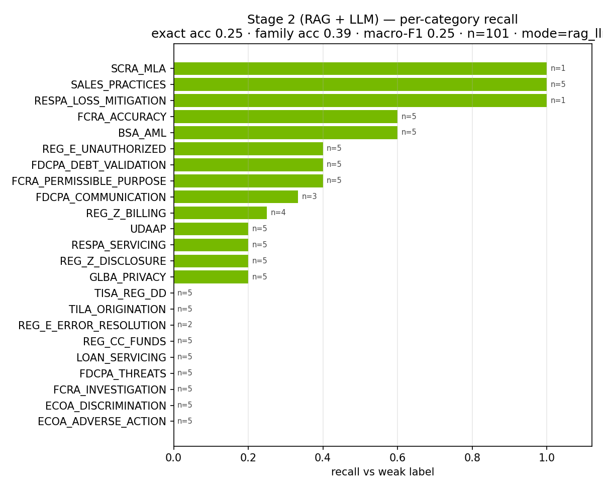

*Figure 12. Per-category recall for stage-2 RAG and LLM labeling against weak labels.*

## 7 · Dual-judge evaluation — NIM and OpenAI as first-class judges

Independent challenge is not a meeting invite; it is a second opinion with a paper trail. We constructed a dual-judge panel in which NVIDIA NIM (meta/llama-3.1-8b-instruct) and OpenAI (gpt-4o-mini) each answer the stage-1 question on every held-out test narrative. Both providers are first-class. OpenAI is not a fallback for NIM, and NIM is not a fallback for OpenAI. A failed API call is recorded as an abstention. It is never silently replaced by a keyword heuristic—the practice that turns an evaluation into a fiction.

On the committed run, NIM agreed with the logistic gate on 305/372 rows (82.0%, 8 abstentions). OpenAI agreed on 276/380 (72.6%, zero abstentions). The judges agreed with each other on 273/372 (73.4%). Cohen's kappa values are modest relative to raw agreement, which is the expected signature of a majority-class problem: much of the apparent consensus is agreement that a complaint is regulatory. The informative residue is the disputed set—35 rows where both judges return the same verdict and that verdict contradicts the gate. On 13 of those rows the judges side with the weak label; on the remainder they do not. Either way, the set is the natural human-adjudication queue. It is also the seed for preference data in the post-training loop that follows.

No party in this triangle is ground truth. Weak labels are regex and taxonomy. The gate was trained on those labels. The LLM judges carry their own biases and prompt sensitivity. Triangulation is the method; humility is the posture.

### Table 8 — Judge agreement and disagreement counts

| pair | n | agree | disagree | rate | Cohen κ |
|---|---|---|---|---|---|
| NIM vs LR gate | 372 | 305 | 67 | 82.0% | 0.0451 |
| OpenAI vs LR gate | 380 | 276 | 104 | 72.6% | 0.2218 |
| NIM vs OpenAI | 372 | 273 | 99 | 73.4% | 0.1196 |
| LR gate vs weak label | 380 | 341 | 39 | 89.7% | 0.5833 |

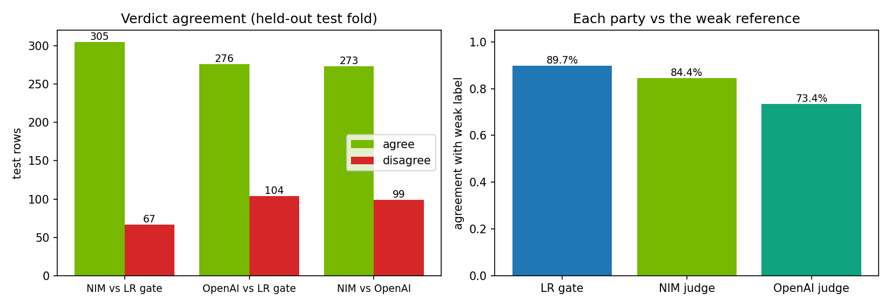

*Figure 13. Dual-judge agreement with the logistic gate and with each other; right panel compares each party to the weak reference.*

## 8 · DPO / RLAIF post-training — a challenger, not a silent replacement

Post-training is how a modern stack improves agent and classifier behavior without pretending that the first supervised fit was the last word. We cast the dual-judge panel as an RLAIF source. On the validation fold—never the test fold—rows where NIM and OpenAI agree become preference pairs: the consensus label is chosen, the opposite regulatory label is rejected. Rows where that consensus also contradicts the logistic gate are marked high-value and upweighted. The committed corpus mixes those RLAIF pairs with weak-label contrastive pairs from the training fold, yielding 3274 pairs ({'rlaif_consensus': 201, 'rlaif_disputed': 33, 'weak_contrastive': 3040}).

For binary pairs in which the rejected label is simply the negation of the chosen label, the reference-free Bradley-Terry / DPO objective reduces to logistic cross-entropy on the preferred label. We therefore train a DistilBERT policy with class-weighted CE under that equivalence, while retaining an optional generative path (LoRA and TRL's DPOTrainer) for GPU environments that want the full conversational DPO setup. The resulting challenger records test ROC-AUC 0.9134 against the production gate's 0.9362, and leakage-free ROC 0.9028 against the gate's 0.8876.

We do not promote the challenger. A post-training loop that cannot lose to the production model on day one is not a loop; it is a press release. The logistic gate remains the millisecond production path. The DistilBERT policy remains the governed challenger until the adjudication queue confirms that the judges were right often enough to justify a change control.

### Table 9 — DPO challenger versus production gate (held-out test)

| party | thr | ROC-AUC | PR-AUC | F1 | leakage-free ROC |
|---|---|---|---|---|---|
| LR gate | 0.491 | 0.9362 | 0.9904 | 0.9401 | 0.8876 |
| DPO policy | 0.885 | 0.9134 | 0.9866 | 0.8852 | 0.9028 |

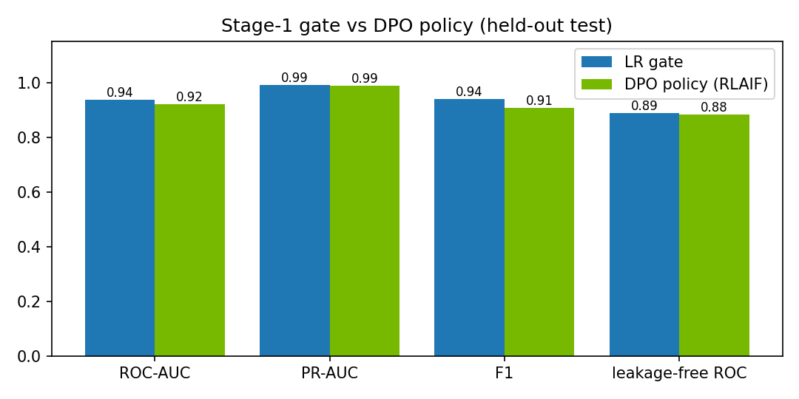

*Figure 14. Production logistic gate versus the DPO/RLAIF DistilBERT challenger on the held-out test fold.*

## 9 · Batch scoring and the ingestion layer

Models that cannot be scored in batch are research toys. The ingestion layer reserves the five-percent holdout precisely so that operations can trigger a run without inventing data. The CLI (scripts/score_batch.py) and the Streamlit batch form accept either that holdout or an uploaded CSV. Each row returns complaint identity, text, stage-1 score, regulatory flag, regulation label and name, confidence, LLM reasoning, citation source, and mode. The same contract that serves a single complaint through the MCP tool serves a thousand complaints through a file. Continuity of interface is not a nicety; it is how control testing stays possible.

## 10 · Serving inside the agentic stack

Serving wraps the model in the protocols the rest of the agentic system already speaks. The complaint MCP server exposes classification, taxonomy listing, sampling, and committed metrics. The Complaint Agent participates in A2A traffic with the orchestrator and sibling agents. LLM inference is provider-portable: NVIDIA NIM for the demo and GPU path, OpenAI for local development, with judge-panel mode addressing both explicitly. Embeddings follow the same portability pattern between OpenAI and NeMo Retriever. Fraud and future BERT-gate serving sit on Triton. Observability—Prometheus, Grafana, DCGM, Jaeger—treats the complaint path as a first-class citizen rather than an afterthought dashboard. Deployment targets include local Compose, NVIDIA Brev GPU instances, and GKE. A model that cannot be watched cannot be trusted, regardless of its ROC.

## 11 · Robustness evidence

Robustness work for stage 1 is recorded in full in the publication-grade stage-1 Model Development Document. Out-of-vocabulary analysis compares the TF-IDF vocabulary with DistilBERT WordPiece coverage. Sensitivity analysis sweeps the decision threshold, perturbs inputs by truncation and noise, ablates class weighting, and re-fits across split seeds. The practical reading is conservative: minority metrics move with the seed because minority support per fold is on the order of fifty cases; the tuned cut-off is itself an estimate; truncation of the narrative is the perturbation that hurts most. None of that is a reason to withhold the model. All of it is a reason to monitor score distributions and gap statistics after deployment rather than assuming the test fold was destiny.


*Figure 15. Out-of-vocabulary analysis — TF-IDF vocabulary versus DistilBERT subword coverage.*


*Figure 16. Threshold sensitivity sweep on the selected stage-1 model.*


*Figure 17. Split-seed stability — minority metrics across five seeds.*


*Figure 18. Discriminative terms from exploratory analysis (research MDD).*

## 12 · Limitations and monitoring

The limitations are not footnotes; they are operating constraints.

Weak labels bound every agreement claim in this document. Until a human-adjudicated golden set exists—seeded by the 35-row disputed set—stage-2 exact agreement must be read as agreement with a noisy reference. Target leakage from narrative regexes is quantified, not eliminated; the leakage-free slice is the honest generalization read. Minority support per fold remains thin enough that minority metrics and the cut-off carry wide uncertainty bands. The dual-judge panel triangulates; it does not anoint. The DPO corpus will strengthen as additional val/train panel runs accumulate high-value pairs, but the challenger stays a challenger until change control says otherwise.

Monitoring after deployment should watch the stage-1 score distribution, the train/test gap analogue on newly labeled slices, the rate of gate-versus-judge disagreement on sampled traffic, stage-2 family agreement, abstention rates on the judge panel when it is re-run, and the usual LLM and GPU latency and error budgets. A model that looked clean at sign-off and then drifts silently is how three lines of defense become three lines of explanation.

## 13 · Disposition and recommendation

Disposition, stated without theater:

The stage-1 production gate—L1 logistic regression at cut-off 0.491—is approved for production use as a millisecond CPU control, with continuous monitoring of generalization gap and score distribution. Stage-2 RAG and LLM labeling is approved with conditions: taxonomy whitelist and citations remain mandatory, and a human-adjudicated golden set remains a standing validation condition before agreement rates may be described as accuracy. The dual-judge panel is approved as an evaluation and adjudication overlay, not as an alternate production path. The DPO/RLAIF policy is retained as a challenger and is not promoted. Batch ingestion is approved for operational scoring against the reserved holdout and for governed file upload.

Overall disposition: Approve with Conditions. The conditions are the golden set, leakage-free reporting in governance packs, and gap monitoring. That is what effective challenge looks like when it is practiced rather than recited.

### Table 10 — Disposition summary

| component | decision | note |
|---|---|---|
| Stage-1 LR gate | Approve | Millisecond CPU; monitor gap |
| Stage-2 RAG+LLM | Approve w/ conditions | Golden set required |
| Dual-judge panel | Approve as overlay | Adjudication queue |
| DPO/RLAIF policy | Challenger — hold | Do not promote yet |
| Batch ingestion | Approve | Holdout + file upload |
| Overall | Approve w/ conditions | SR 11-7 effective challenge |

## 14 · Reproducibility and artifact index

```bash
python scripts/fetch_cfpb_complaints.py
python scripts/generate_complaint_data_profile.py
python scripts/generate_complaint_model_docs.py
python scripts/generate_model_development_doc.py
python scripts/judge_agreement_study.py
python scripts/judge_agreement_study.py --split val
python scripts/train_dpo_from_judges.py
python scripts/generate_e2e_model_development_doc.py
python scripts/score_batch.py --limit 25
```

| artifact | path |
|---|---|
| Curated data | `data/complaints/cfpb_complaints.csv` |
| Production metrics | `docs/complaint_model/metrics.json` |
| Stage-1 MDD + leakage | `docs/model_development/results.json` |
| Judge panel | `docs/complaint_model/judge_agreement.json` |
| DPO results | `docs/complaint_model/dpo_results.json` |
| Model card | `data/models/model_card_complaint_reg24.md` |
| This document | `docs/complaint_model/05_end_to_end_model_development.md` |

---

*CMPL-REG-24 · End-to-End Model Development Document · 2026-08-04 03:47 UTC*
*Prepared as a governance-grade development record for independent validation and executive review.*
