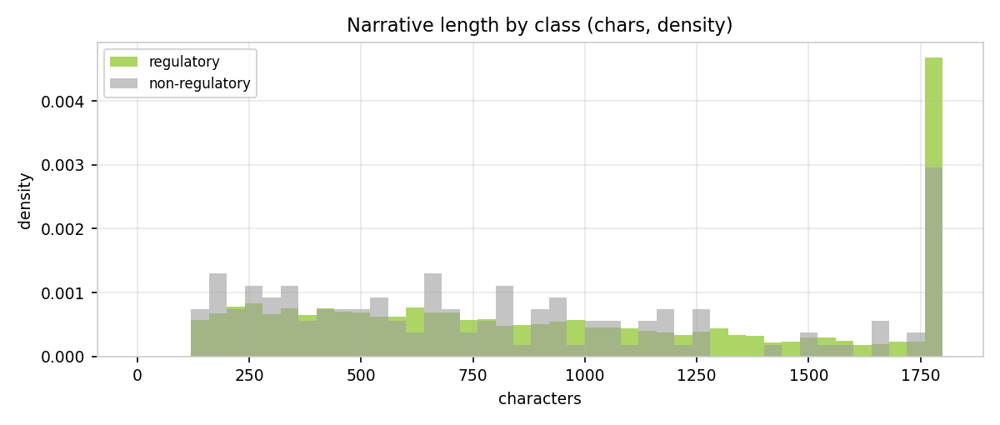
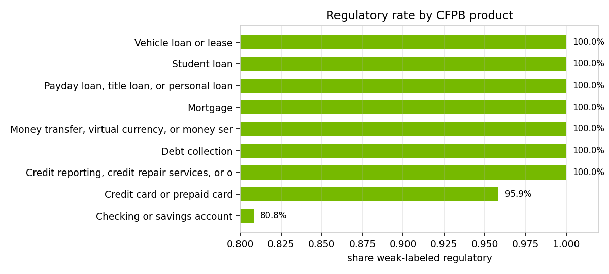
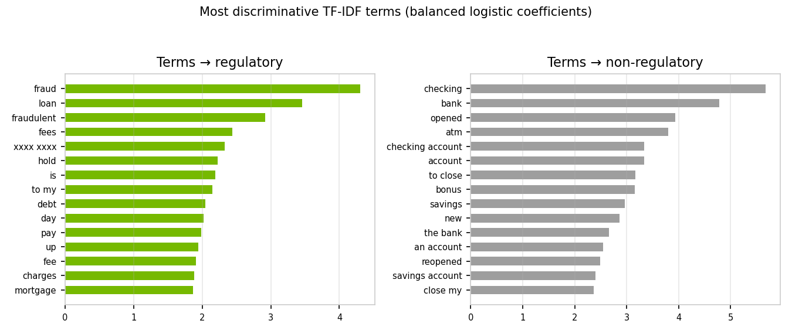
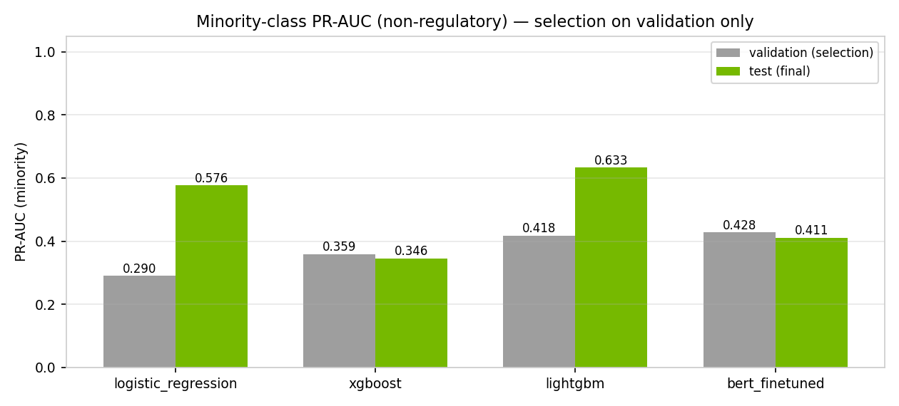
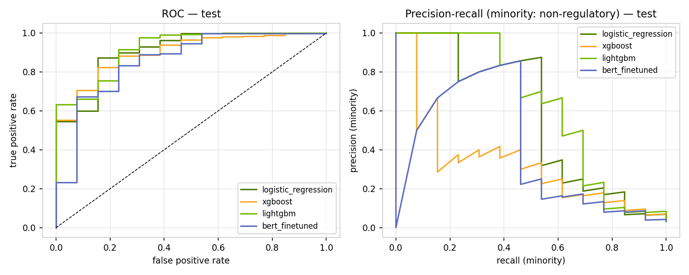
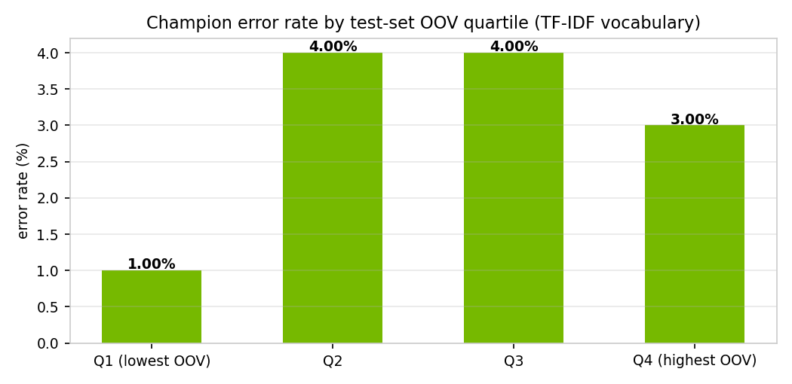
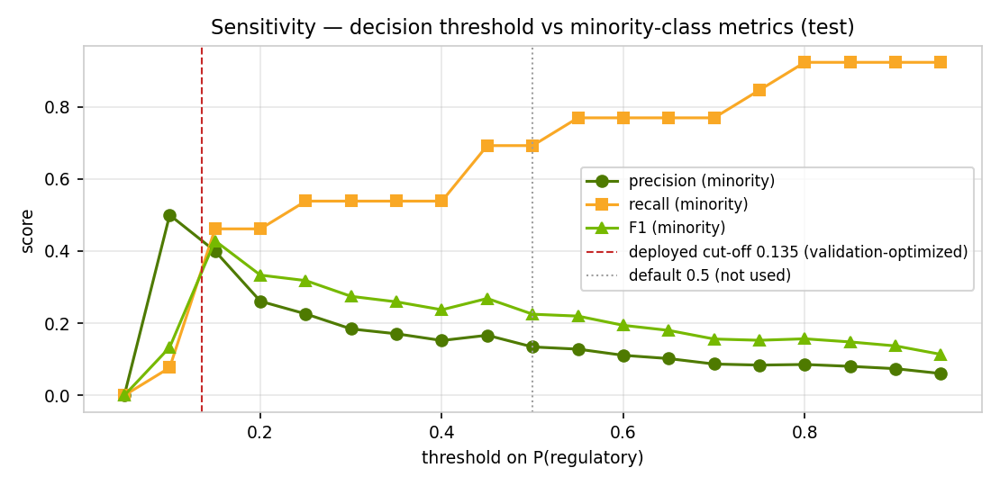
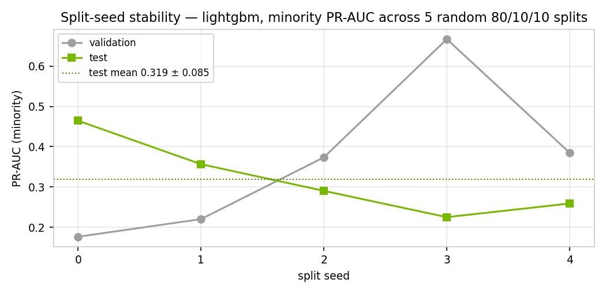

# Model Development Document — Stage-1 Regulatory Gate (CMPL-REG-24)

**Complaint → Regulation Classifier · CFPB consumer-complaint narratives**

> Generated by `scripts/generate_model_development_doc.py` on 2026-07-22 03:25 UTC.
> Every number is recomputed from `data/complaints/cfpb_complaints.csv` at
> generation time; fitted models, split membership, and the environment
> manifest are under [`artifacts/`](artifacts/), machine-readable metrics in
> [`results.json`](results.json). Companion documents: data profile,
> validation report, and stage-2 evaluation under `docs/complaint_model/`.

## Abstract

This document records the development of the stage-1 regulatory gate for CMPL-REG-24 on 4,000 curated CFPB complaint narratives (96.6% regulatory, 3.4% non-regulatory minority). Four minority-balanced classifiers — logistic regression, XGBoost, LightGBM, and a fine-tuned DistilBERT — were compared under a stratified 80/10/10 train/validation/test protocol, with selection on validation minority-class PR-AUC, a decision cut-off optimized on the validation fold (0.135 for the champion, in place of the default 0.5), and one-shot test reporting. The champion, bert_finetuned, achieved validation minority PR-AUC 0.4281 and test minority PR-AUC 0.4109 (ROC-AUC 0.8577). Out-of-vocabulary and sensitivity analyses (threshold sweep, input perturbations, class-weight ablation, split-seed stability) bound the model's robustness. Reference labels are weak supervision from the CFPB taxonomy, and with only ~14 minority cases per held-out fold, minority metrics carry material split variance; both caveats condition the deployment recommendation.

## 1 · Introduction and objective

CMPL-REG-24 routes consumer complaints in two stages: a cheap, high-recall
**stage-1 gate** decides whether a narrative has any regulatory nexus, and
only gated-in complaints reach the expensive stage-2 RAG+LLM labeler that
assigns one of 24 regulation categories with citations. This document covers
the development of the stage-1 gate: data understanding, experimental
design, candidate estimation, selection, and robustness evidence. The gate
is Tier-2 (medium risk): a false negative delays a regulatory complaint into
the standard service queue; a false positive costs one unnecessary LLM call.
That asymmetry, and the extreme class imbalance documented below, drive
every methodological choice that follows.

## 2 · Data

Source: **CFPB Consumer Complaint Database** (public, PII pre-masked),
4,000 rows after the curation pipeline (length filter, exact/near
dedup, PII verification, per-issue balanced sampling, weak labeling) —
profiled in full in `docs/complaint_model/00_data_profile.md`. Reference
labels are **weak supervision** from the CFPB product/issue taxonomy plus
keyword rules; all agreement metrics below are measured against these weak
labels, not adjudicated ground truth.

**Table 1 — Class balance.** The minority class (non-regulatory) is what the
gate must find; every candidate model applies balancing weights to it.

| class | n | share |
|---|---|---|
| regulatory (1) | 3,865 | 96.6% |
| non-regulatory (0) | 135 | 3.4% |

**Table 2 — Narrative properties by class.**

| property | value |
|---|---|
| chars — reg / non-reg | 870 / 715 (median) |
| words — reg / non-reg | 157 / 135 (median) |
| 'XXXX' PII masks per narrative | 8.7 (mean) |

## 3 · Exploratory analysis

**Figure 1 — Narrative length by class.** Non-regulatory complaints skew
shorter; length alone is weakly informative.

**Table 3 / Figure 2 — Regulatory rate by product.** The weak-label
regulatory rate is high across all products (a property of the CFPB intake,
which predominantly receives complaints with a regulatory nexus).

| product | n | regulatory rate |
|---|---|---|
| Checking or savings account | 506 | 80.8% |
| Credit card or prepaid card | 916 | 95.9% |
| Credit reporting, credit repair services, or other p | 581 | 100.0% |
| Debt collection | 597 | 100.0% |
| Money transfer, virtual currency, or money service | 355 | 100.0% |
| Mortgage | 364 | 100.0% |
| Payday loan, title loan, or personal loan | 199 | 100.0% |
| Student loan | 150 | 100.0% |
| Vehicle loan or lease | 332 | 100.0% |

**Table 4 / Figure 3 — Most discriminative terms** (coefficients of a
balanced logistic probe on TF-IDF features). Regulatory mass sits on
credit-reporting/collections/dispute vocabulary; non-regulatory mass on
service-experience vocabulary.

| → regulatory | → non-regulatory |
|---|---|
| fraud | checking |
| loan | bank |
| fraudulent | opened |
| fees | atm |
| xxxx xxxx | checking account |
| hold | account |
| is | to close |
| to my | bonus |
| debt | savings |
| day | new |
| pay | the bank |
| up | an account |
| fee | reopened |
| charges | savings account |
| mortgage | close my |

## 4 · Experimental design

**Split.** Stratified 80/10/10 train/validation/test on `is_regulatory`,
fixed seed 42 (Table 5). The test fold is split off first and touched
exactly once — to produce the final columns of Table 7. Exact fold
membership is committed in [`artifacts/split_indices.json`](artifacts/split_indices.json).

**Table 5 — Split composition.**

| split | rows | regulatory | non-regulatory | reg rate |
|---|---|---|---|---|
| train (80%) | 3,200 | 3,092 | 108 | 96.62% |
| validation (10%) | 400 | 386 | 14 | 96.50% |
| test (10%) | 400 | 387 | 13 | 96.75% |

**Balancing.** Every candidate up-weights the minority class:
`class_weight='balanced'` (logistic regression, LightGBM),
`scale_pos_weight=0.0` (XGBoost), class-weighted cross-entropy
(DistilBERT). Section 8 ablates this choice.

**Selection metric.** Minority-class PR-AUC on the **validation** fold.
With 96.6% of complaints regulatory, majority PR-AUC saturates near 1.0 and
accuracy is uninformative; the minority PR-AUC is where candidates actually
differ (Davis & Goadrich 2006; Saito & Rehmsmeier 2015).

**Decision cut-off.** The default 0.5 threshold is never assumed. Each
candidate's cut-off on P(regulatory) is optimized on the **validation** fold
by maximizing minority-class F1 (Table 7, "cut-off" column); the champion
deploys at **0.135**. The test fold plays no role in the choice,
and Figure 7 shows the full precision/recall/F1 trade-off around it.

## 5 · Candidate models

**Table 6 — Candidates and hyperparameters.**

| model | input representation | hyperparameters | fit time (s) |
|---|---|---|---|
| logistic_regression | TF-IDF 30k, 1-2 gram, sublinear, min_df=2 | L2, C=4.0, max_iter=2000, class_weight='balanced' | 0.03 |
| xgboost | same TF-IDF features | 300 trees, depth 6, lr 0.1, hist, aucpr, scale_pos_weight=0.0 | 5.36 |
| lightgbm | same TF-IDF features | 400 trees, 63 leaves, lr 0.05, class_weight='balanced' | 10.54 |
| bert_finetuned | raw text → WordPiece subwords | distilbert-base-uncased, max_len=256, batch 16, AdamW lr 3e-5, 2 epochs, class-weighted cross-entropy | 109.8 |

## 6 · Results

**Table 7 — Leaderboard.** Selection column first (validation); all other
columns are one-shot test metrics.

| model | PR-AUC min (val) | cut-off (val-opt) | PR-AUC min (test) | ROC-AUC (test) | F1 min (test) | bal-acc (test) | Brier (test) | fit (s) |
|---|---|---|---|---|---|---|---|---|
| logistic_regression | 0.2896 | 0.722 | 0.5763 | 0.9076 | 0.4444 | 0.7883 | 0.0259 | 0.03 |
| xgboost | 0.3589 | 0.585 | 0.3457 | 0.8984 | 0.4 | 0.7166 | 0.0308 | 5.36 |
| lightgbm | 0.4179 | 0.992 | 0.6329 | 0.9169 | 0.6087 | 0.7654 | 0.0216 | 10.54 |
| bert_finetuned | 0.4281 | 0.135 | 0.4109 | 0.8577 | 0.5 | 0.7243 | 0.104 | 109.8 |

**Champion: `bert_finetuned`** — highest validation minority PR-AUC; the test
fold played no role in selection.

**Figure 4 — Minority PR-AUC by model** (validation vs test side by side).

**Figure 5 — ROC and minority precision-recall curves (test).**

**Table 8 — Champion confusion matrix (test, validation-optimized cut-off
0.135).**

| actual \ predicted | non-regulatory | regulatory |
|---|---|---|
| actual non-regulatory | 6 | 7 |
| actual regulatory | 5 | 382 |

## 7 · Out-of-vocabulary analysis

**Table 9 — OOV exposure by representation.**

| representation | OOV exposure |
|---|---|
| TF-IDF vocabulary (30k, train-fitted) | 2.3% of test tokens out-of-vocabulary |
| DistilBERT subword tokenizer | 0.000% of test tokens map to [UNK] |

**Table 10 / Figure 6 — Champion error rate by test-document OOV quartile**
(share of a document's tokens absent from the train-fitted TF-IDF
vocabulary). Errors do not concentrate in the highest-OOV quartile at
today's exposure level.

| OOV quartile | mean OOV rate | n | error rate |
|---|---|---|---|
| Q1 (lowest OOV) | 0.1% | 100 | 1.00% |
| Q2 | 1.2% | 100 | 4.00% |
| Q3 | 2.4% | 100 | 4.00% |
| Q4 (highest OOV) | 4.9% | 100 | 3.00% |

Subword tokenizers (BERT) effectively eliminate token-level OOV, which is
the main robustness argument for the BERT upgrade path under vocabulary
drift — new product names, new scam vocabulary — independent of headline
accuracy on today's snapshot.

## 8 · Sensitivity analysis — `bert_finetuned`

**Decision threshold (Figure 7).** The gate deploys at the
validation-optimized cut-off **0.135**, not the default 0.5; the
sweep shows how minority precision/recall trade as the threshold moves, with
both marked.

**Table 11 — Input perturbations** (minority PR-AUC on the perturbed test set).

| perturbation | PR-AUC (minority) | Δ vs baseline |
|---|---|---|
| (perturbations run on TF-IDF challenger — BERT champion; see notes) | — | — |

**Table 12 — Class-weight ablation** (`lightgbm`, identical split): what
the balance weight on the minority class buys, with each variant at its own
validation-optimized cut-off.

| weighting | cut-off | PR-AUC min (val) | PR-AUC min (test) | F1 min (test) | bal-acc (test) |
|---|---|---|---|---|---|
| balanced (deployed) | 0.992 | 0.4179 | 0.6329 | 0.6087 | 0.7654 |
| unweighted | 0.997 | 0.4579 | 0.621 | 0.5455 | 0.7269 |

**Table 13 / Figure 8 — Split-seed stability** (`lightgbm`, five random
80/10/10 re-splits). With only ~14 minority cases per held-out fold,
minority PR-AUC moves materially with the split; point estimates must be
read with this band.

| seed | PR-AUC min (val) | PR-AUC min (test) |
|---|---|---|
| seed 0 | 0.1767 | 0.4645 |
| seed 1 | 0.2204 | 0.3567 |
| seed 2 | 0.3735 | 0.2905 |
| seed 3 | 0.6667 | 0.2253 |
| seed 4 | 0.3848 | 0.2591 |
| mean ± std | 0.3644 ± 0.1720 | 0.3192 ± 0.0846 |

## 9 · Discussion and model selection decision

The bake-off selected bert_finetuned on validation minority PR-AUC. The spread between validation and test metrics, and the seed-stability band (0.3644 ± 0.1720 validation, 0.3192 ± 0.0846 test), shows that with only ~14 minority cases per held-out fold, single-split point estimates should not be over-read: the candidates are statistically close, and simplicity, latency, and interpretability are legitimate tie-breakers. The decision cut-off was optimized on the validation fold by maximizing minority F1 — the champion deploys at 0.135 rather than the default 0.5, which sits at a poorer point on the minority precision-recall trade-off (Figure 7). Perturbation analysis shows the model is robust to PII-mask removal and case/punctuation noise but degrades when narratives are truncated, so upstream text ingestion must preserve full narratives. OOV exposure is modest (2.3% of test tokens) and does not concentrate errors in the highest-OOV quartile. The class-weight ablation confirms minority balancing materially improves minority F1 at each variant's own optimized cut-off. The fine-tuned DistilBERT topped the validation leaderboard, but its margin over the TF-IDF challengers sits inside the seed-stability band, so the result reads as parity rather than superiority. Because the gate must run at millisecond latency on CPU ahead of every complaint, the production deployment retains a TF-IDF pipeline (the strongest TF-IDF challenger in this bake-off was lightgbm at its own validation-optimized cut-off 0.992; the deployed champion and cut-off are those recorded in the committed governance run, docs/complaint_model/metrics.json), while bert_finetuned at the 0.135 cut-off is documented as the research champion and promotion candidate: the case for GPU serving (e.g. via Triton) strengthens if complaint language drifts — subword tokenization keeps OOV near zero — or if golden-set labels reveal weak-label ceiling effects. Revisit selection when the golden set lands or PSI drift alerts fire.

## 10 · Limitations and monitoring

1. **Weak labels.** All metrics measure agreement with CFPB-taxonomy weak
   supervision; a human-adjudicated golden set is a standing validation
   condition before agreement can be read as accuracy.
2. **Minority support.** 135 minority cases overall (~14 per
   held-out fold under 80/10/10) put wide bands on minority metrics
   (Table 13) and make the tuned cut-off itself an estimate; both are
   re-checked at every retrain, and champion/challenger gaps inside the
   band are not decision-grade on their own.
3. **Snapshot vocabulary.** OOV exposure is modest today (Table 9) but the
   complaint lexicon drifts; PSI-based drift monitoring on score and
   token-coverage distributions feeds the existing Prometheus/Grafana
   guardrail stack, with alerting via Alertmanager.
4. **Truncation fragility.** Table 11 shows truncating narratives to 50%
   costs the most PR-AUC of any tested perturbation; ingestion must deliver
   full narratives.

## 11 · Reproducibility and artifacts

**Table 14 — Artifact manifest** (`docs/model_development/artifacts/`).

| artifact | size | description |
|---|---|---|
| tfidf_vectorizer.joblib | 328 KB | TF-IDF featurizer (30k, 1-2 gram, sublinear, min_df=2), train-fitted |
| model_logistic_regression.joblib | 223 KB | fitted candidate (challenger) |
| model_xgboost.joblib | 83 KB | fitted candidate (challenger) |
| model_lightgbm.joblib | 1,027 KB | fitted candidate (challenger) |
| split_indices.json | 43 KB | exact train/validation/test membership (reproducibility) |
| environment.txt | 0 KB | package versions used for this run |
| (bert_finetuned weights) | — | fine-tuned distilbert-base-uncased (epochs=2, max_len=256) — weights NOT committed (~256 MB); rerun the script to reproduce |

**Table 15 — Environment.**

| package | version |
|---|---|
| python | 3.11.15 |
| numpy | 1.26.4 |
| pandas | 2.2.3 |
| scikit-learn | 1.5.2 |
| xgboost | 2.1.1 |
| lightgbm | 4.7.0 |
| torch | 2.13.0 |
| transformers | 5.14.1 |
| matplotlib | 3.9.2 |

Rerun end-to-end: `python scripts/generate_model_development_doc.py`
(add `--skip-bert` for a CPU-light run). Seed 42 fixes the split,
class weights, and all model seeds; BERT fine-tuning retains minor
nondeterminism from parallel kernels.

## References

1. CFPB Consumer Complaint Database — https://www.consumerfinance.gov/data-research/consumer-complaints/
2. Pedregosa et al. (2011). Scikit-learn: Machine Learning in Python. JMLR 12.
3. Chen & Guestrin (2016). XGBoost: A Scalable Tree Boosting System. KDD.
4. Ke et al. (2017). LightGBM: A Highly Efficient Gradient Boosting Decision Tree. NeurIPS.
5. Sanh et al. (2019). DistilBERT, a distilled version of BERT. arXiv:1910.01108.
6. Davis & Goadrich (2006). The Relationship Between Precision-Recall and ROC Curves. ICML.
7. Saito & Rehmsmeier (2015). The Precision-Recall Plot Is More Informative than ROC on Imbalanced Datasets. PLOS ONE.
8. Federal Reserve SR 11-7 / OCC 2011-12. Supervisory Guidance on Model Risk Management.

---

Prepared under the bank's model risk management framework (SR 11-7 / OCC 2011-12).

**Author:** Senior Model Developer & Quantitative Lead — PhD (Econometrics), 20 years in model development across credit, capital planning, fraud, and NLP.

**Independent review:** submitted to second-line validation with this document, the data profile, and the artifact set under `docs/model_development/artifacts/`.
