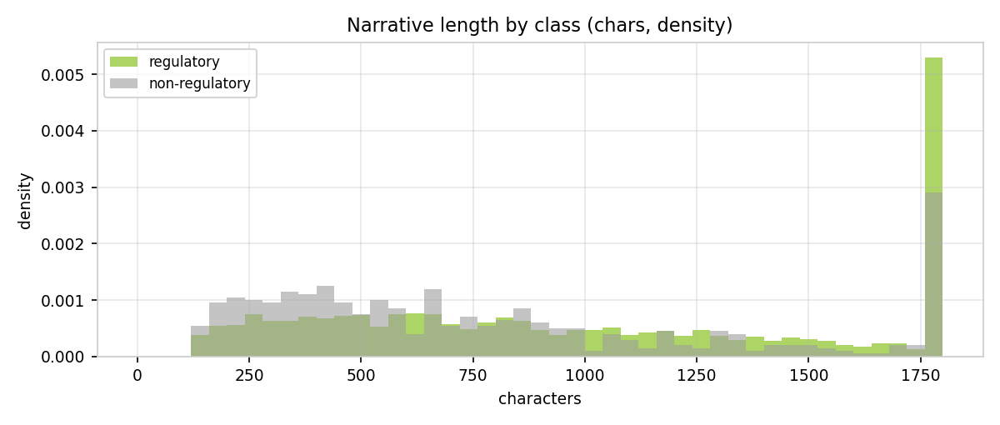
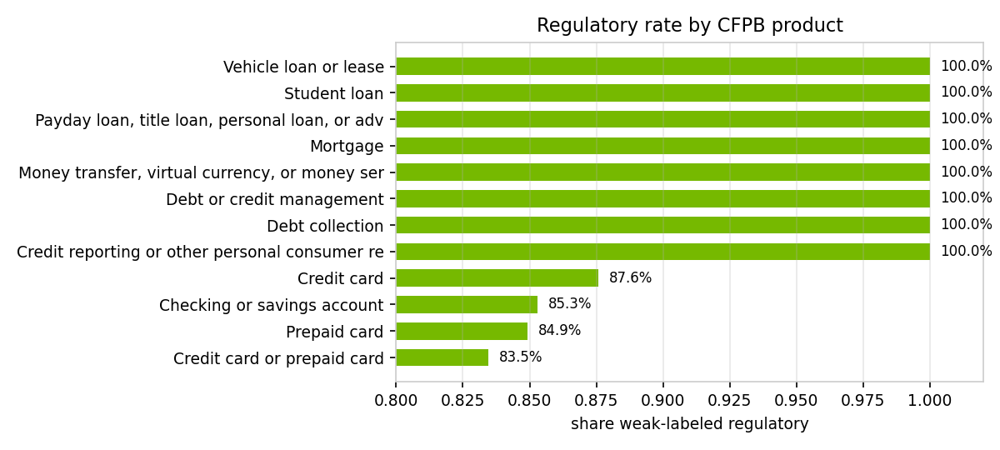
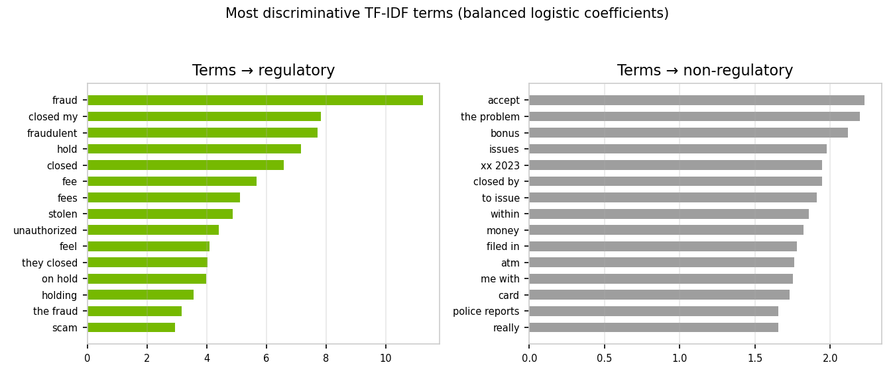
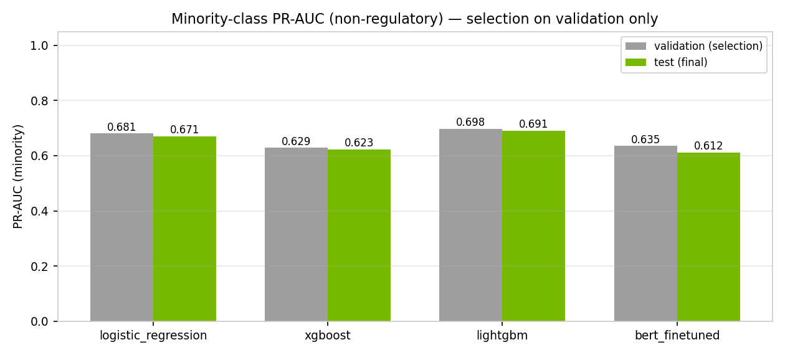
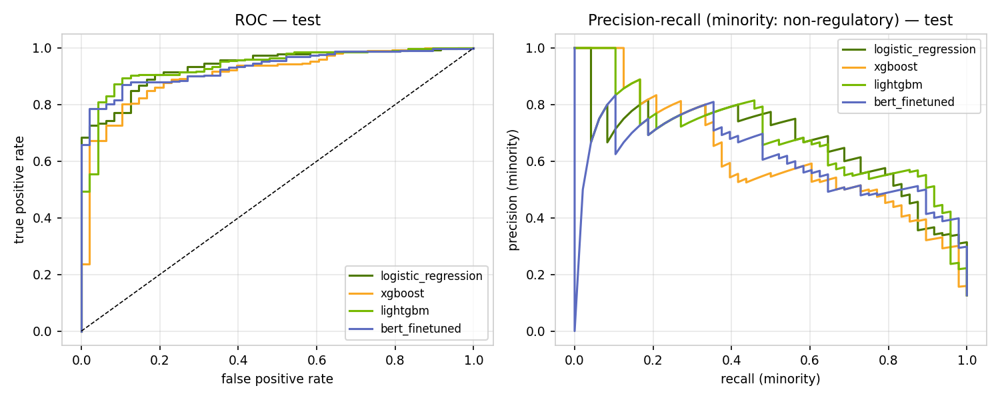
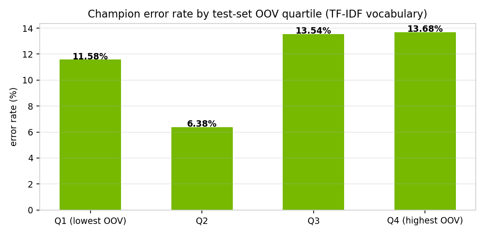
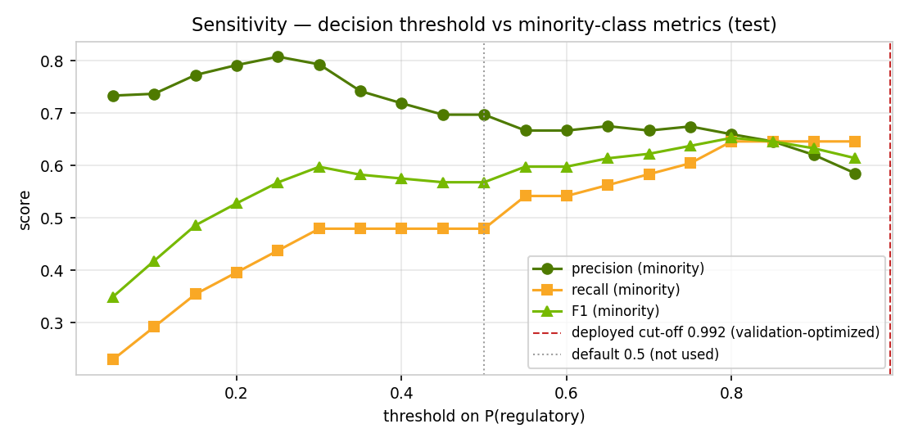
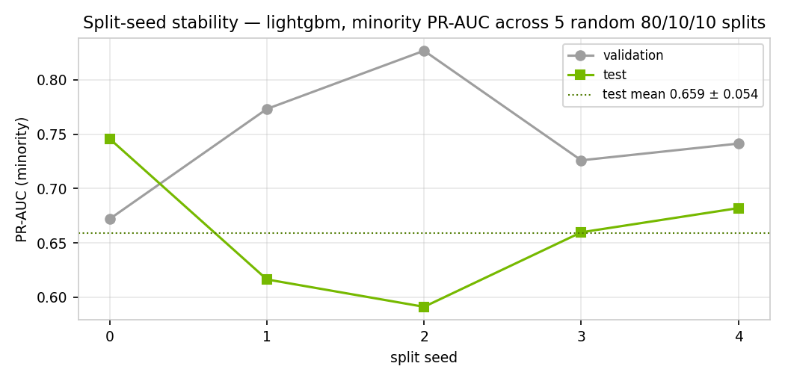

# Model Development Document — Stage-1 Regulatory Gate (CMPL-REG-24)

**Complaint → Regulation Classifier · CFPB consumer-complaint narratives**

> Generated by `scripts/generate_model_development_doc.py` on 2026-07-29 20:42 UTC.
> Every number is recomputed from `data/complaints/cfpb_complaints.csv` at
> generation time; fitted models, split membership, and the environment
> manifest are under [`artifacts/`](artifacts/), machine-readable metrics in
> [`results.json`](results.json). Companion documents: data profile,
> validation report, and stage-2 evaluation under `docs/complaint_model/`.

## Abstract

This document records the development of the stage-1 regulatory gate for CMPL-REG-24 on 4,000 curated CFPB complaint narratives (87.5% regulatory, 12.5% non-regulatory minority). Four minority-balanced classifiers — logistic regression, XGBoost, LightGBM, and a fine-tuned DistilBERT — were compared under a stratified 80/10/10 train/validation/test protocol (applied after reserving a 5% scoring holdout for the batch-ingestion layer), with selection on validation minority-class PR-AUC, a decision cut-off optimized on the validation fold (0.992 for the champion, in place of the default 0.5), and one-shot test reporting. The champion, lightgbm, achieved validation minority PR-AUC 0.6978 and test minority PR-AUC 0.6908 (ROC-AUC 0.9367). Out-of-vocabulary and sensitivity analyses (threshold sweep, input perturbations, class-weight ablation, split-seed stability) bound the model's robustness. Reference labels are weak supervision from the CFPB taxonomy, and with only ~47 minority cases per held-out fold, minority metrics carry material split variance; both caveats condition the deployment recommendation.

## 1 · Introduction and objective

CMPL-REG-24 routes consumer complaints in two stages: a cheap, high-recall
**stage-1 gate** decides whether a narrative has any regulatory nexus, and
only gated-in complaints reach the expensive stage-2 RAG+LLM labeler that
assigns one of 24 regulation categories with citations. This document covers
the development of the stage-1 gate: data understanding, experimental
design, candidate estimation, selection, and robustness evidence. The gate
is Tier-2 (medium risk): a false negative delays a regulatory complaint into
the standard service queue; a false positive costs one unnecessary LLM call.
That asymmetry, and the extreme class imbalance documented below, drive
every methodological choice that follows.

## 2 · Data

Source: **CFPB Consumer Complaint Database** (public, PII pre-masked),
4,000 rows after the curation pipeline (length filter, exact/near
dedup, PII verification, per-issue balanced sampling, weak labeling) —
profiled in full in `docs/complaint_model/00_data_profile.md`. Reference
labels are **weak supervision** from the CFPB product/issue taxonomy plus
keyword rules; all agreement metrics below are measured against these weak
labels, not adjudicated ground truth.

**Table 1 — Class balance.** The minority class (non-regulatory) is what the
gate must find; every candidate model applies balancing weights to it.

| class | n | share |
|---|---|---|
| regulatory (1) | 3,500 | 87.5% |
| non-regulatory (0) | 500 | 12.5% |

**Table 2 — Narrative properties by class.**

| property | value |
|---|---|
| chars — reg / non-reg | 911 / 656 (median) |
| words — reg / non-reg | 168 / 122 (median) |
| 'XXXX' PII masks per narrative | 8.7 (mean) |

## 3 · Exploratory analysis

**Figure 1 — Narrative length by class.** Non-regulatory complaints skew
shorter; length alone is weakly informative.

**Table 3 / Figure 2 — Regulatory rate by product.** The weak-label
regulatory rate is high across all products (a property of the CFPB intake,
which predominantly receives complaints with a regulatory nexus).

| product | n | regulatory rate |
|---|---|---|
| Credit card or prepaid card | 508 | 83.5% |
| Prepaid card | 126 | 84.9% |
| Checking or savings account | 2,068 | 85.3% |
| Credit card | 748 | 87.6% |
| Credit reporting or other personal consumer reports | 449 | 100.0% |
| Debt collection | 55 | 100.0% |
| Debt or credit management | 3 | 100.0% |
| Money transfer, virtual currency, or money service | 11 | 100.0% |
| Mortgage | 13 | 100.0% |
| Payday loan, title loan, personal loan, or advance l | 5 | 100.0% |
| Student loan | 4 | 100.0% |
| Vehicle loan or lease | 10 | 100.0% |

**Table 4 / Figure 3 — Most discriminative terms** (coefficients of a
balanced logistic probe on TF-IDF features). Regulatory mass sits on
credit-reporting/collections/dispute vocabulary; non-regulatory mass on
service-experience vocabulary.

| → regulatory | → non-regulatory |
|---|---|
| fraud | accept |
| closed my | the problem |
| fraudulent | bonus |
| hold | issues |
| closed | xx 2023 |
| fee | closed by |
| fees | to issue |
| stolen | within |
| unauthorized | money |
| feel | filed in |
| they closed | atm |
| on hold | me with |
| holding | card |
| the fraud | police reports |
| scam | really |

## 4 · Experimental design

**Split.** A stratified 5% scoring holdout is reserved FIRST — it feeds the
batch-ingestion layer (`scripts/score_batch.py`, UI upload) and is never
touched by training, validation, test, or threshold tuning. The remaining
95% is split stratified 80/10/10 train/validation/test on `is_regulatory`,
fixed seed 42 (Table 5). The test fold is split off first and touched
exactly once — to produce the final columns of Table 7. Exact fold
membership is committed in [`artifacts/split_indices.json`](artifacts/split_indices.json).

**Table 5 — Split composition.**

| split | rows | regulatory | non-regulatory | reg rate |
|---|---|---|---|---|
| train (80%) | 3,040 | 2,660 | 380 | 87.50% |
| validation (10%) | 380 | 333 | 47 | 87.63% |
| test (10%) | 380 | 332 | 48 | 87.37% |
| scoring holdout (5% of full) | 200 | 175 | 25 | 87.50% |

**Balancing.** Every candidate up-weights the minority class:
`class_weight='balanced'` (logistic regression, LightGBM),
`scale_pos_weight=0.1` (XGBoost), class-weighted cross-entropy
(DistilBERT). Section 8 ablates this choice.

**Selection metric.** Minority-class PR-AUC on the **validation** fold.
With 87.5% of complaints regulatory, majority PR-AUC saturates near 1.0 and
accuracy is uninformative; the minority PR-AUC is where candidates actually
differ (Davis & Goadrich 2006; Saito & Rehmsmeier 2015).

**Decision cut-off.** The default 0.5 threshold is never assumed. Each
candidate's cut-off on P(regulatory) is optimized on the **validation** fold
by maximizing minority-class F1 (Table 7, "cut-off" column); the champion
deploys at **0.992**. The test fold plays no role in the choice,
and Figure 7 shows the full precision/recall/F1 trade-off around it.

## 5 · Candidate models

**Table 6 — Candidates and hyperparameters.**

| model | input representation | hyperparameters | fit time (s) |
|---|---|---|---|
| logistic_regression | TF-IDF 30k, 1-2 gram, sublinear, min_df=2 | L1, C=4.0 (validation-tuned over {l1,l2}×C to close the train/test ROC gap), liblinear, class_weight='balanced' | 0.06 |
| xgboost | same TF-IDF features | 300 trees, depth 6, lr 0.1, hist, aucpr, scale_pos_weight=0.1 | 2.68 |
| lightgbm | same TF-IDF features | 400 trees, 63 leaves, lr 0.05, class_weight='balanced' | 10.05 |
| bert_finetuned | raw text → WordPiece subwords | distilbert-base-uncased, max_len=256, batch 16, AdamW lr 3e-5, 2 epochs, class-weighted cross-entropy | 103.7 |

## 6 · Results

**Table 7 — Leaderboard.** Selection column first (validation); all other
columns are one-shot test metrics.

| model | PR-AUC min (val) | cut-off (val-opt) | PR-AUC min (test) | ROC-AUC (test) | F1 min (test) | bal-acc (test) | Brier (test) | fit (s) |
|---|---|---|---|---|---|---|---|---|
| logistic_regression | 0.6814 | 0.491 | 0.6707 | 0.9362 | 0.6422 | 0.8254 | 0.0741 | 0.06 |
| xgboost | 0.6294 | 0.545 | 0.6234 | 0.9073 | 0.5979 | 0.772 | 0.0746 | 2.68 |
| lightgbm | 0.6978 | 0.992 | 0.6908 | 0.9367 | 0.6261 | 0.8283 | 0.0745 | 10.05 |
| bert_finetuned | 0.6355 | 0.478 | 0.6116 | 0.9317 | 0.5854 | 0.8163 | 0.088 | 103.7 |

**Champion: `lightgbm`** — highest validation minority PR-AUC; the test
fold played no role in selection.

**Figure 4 — Minority PR-AUC by model** (validation vs test side by side).

**Figure 5 — ROC and minority precision-recall curves (test).**

**Table 8 — Champion confusion matrix (test, validation-optimized cut-off
0.992).**

| actual \ predicted | non-regulatory | regulatory |
|---|---|---|
| actual non-regulatory | 36 | 12 |
| actual regulatory | 31 | 301 |

## 7 · Out-of-vocabulary analysis

**Table 9 — OOV exposure by representation.**

| representation | OOV exposure |
|---|---|
| TF-IDF vocabulary (30k, train-fitted) | 1.9% of test tokens out-of-vocabulary |
| DistilBERT subword tokenizer | 0.000% of test tokens map to [UNK] |

**Table 10 / Figure 6 — Champion error rate by test-document OOV quartile**
(share of a document's tokens absent from the train-fitted TF-IDF
vocabulary). Errors do not concentrate in the highest-OOV quartile at
today's exposure level.

| OOV quartile | mean OOV rate | n | error rate |
|---|---|---|---|
| Q1 (lowest OOV) | 0.0% | 95 | 11.58% |
| Q2 | 0.8% | 94 | 6.38% |
| Q3 | 1.8% | 96 | 13.54% |
| Q4 (highest OOV) | 4.3% | 95 | 13.68% |

Subword tokenizers (BERT) effectively eliminate token-level OOV, which is
the main robustness argument for the BERT upgrade path under vocabulary
drift — new product names, new scam vocabulary — independent of headline
accuracy on today's snapshot.

## 8 · Sensitivity analysis — `lightgbm`

**Decision threshold (Figure 7).** The gate deploys at the
validation-optimized cut-off **0.992**, not the default 0.5; the
sweep shows how minority precision/recall trade as the threshold moves, with
both marked.

**Table 11 — Input perturbations** (minority PR-AUC on the perturbed test set).

| perturbation | PR-AUC (minority) | Δ vs baseline |
|---|---|---|
| baseline (unperturbed) | 0.6908 | — |
| remove CFPB 'XXXX' PII masks | 0.6925 | +0.0016 |
| lowercase + strip punctuation | 0.6908 | +0.0000 |
| keep only first 50% of narrative | 0.3565 | -0.3344 |
| randomly drop 10% of tokens | 0.6622 | -0.0286 |

**Table 12 — Class-weight ablation** (`lightgbm`, identical split): what
the balance weight on the minority class buys, with each variant at its own
validation-optimized cut-off.

| weighting | cut-off | PR-AUC min (val) | PR-AUC min (test) | F1 min (test) | bal-acc (test) |
|---|---|---|---|---|---|
| balanced (deployed) | 0.992 | 0.6978 | 0.6908 | 0.6261 | 0.8283 |
| unweighted | 0.949 | 0.6991 | 0.6933 | 0.6122 | 0.7824 |

**Table 13 / Figure 8 — Split-seed stability** (`lightgbm`, five random
80/10/10 re-splits). With only ~47 minority cases per held-out fold,
minority PR-AUC moves materially with the split; point estimates must be
read with this band.

| seed | PR-AUC min (val) | PR-AUC min (test) |
|---|---|---|
| seed 0 | 0.6720 | 0.7458 |
| seed 1 | 0.7733 | 0.6163 |
| seed 2 | 0.8269 | 0.5911 |
| seed 3 | 0.7260 | 0.6597 |
| seed 4 | 0.7414 | 0.6820 |
| mean ± std | 0.7479 ± 0.0513 | 0.6590 ± 0.0538 |

## 9 · Leakage audit

Two leakage vectors are audited at every regeneration of this document.

**Split contamination (Table 14).** Curation deduplicates exact narrative
hashes, 200-char prefixes, and TF-IDF-cosine near-copies (≥ 0.9) before any
split, so no test row should be a copy or near-copy of a training row. The
check runs post-split as a guard (also enforced in
`tests/test_complaints.py::test_no_cross_split_duplicate_leakage`).

| check (test vs train) | count | expected | status |
|---|---|---|---|
| exact duplicate (normalized hash) | 0 | 0 | pass |
| near-duplicate (200-char prefix) | 0 | 0 | pass |
| near-duplicate (TF-IDF cosine ≥ 0.9) | 2 | ≤ 1% of test | pass |

**Weak-label target leakage (Table 15).** 75% of
rows get their label from a narrative regex (`label_source == 'narrative'`)
— the labeling rule is embedded in the model's input text, so headline
agreement on those rows partly measures the model re-learning the labeler,
not generalization. The honest read is the **metadata-labeled slice**, where
the label derives only from the CFPB `issue` field, which the model never
sees. Champion (`lightgbm`) at its committed cut-off 0.992:

| test slice | n | reg-rate | ROC-AUC | PR-AUC (reg) | F1 (minority) | balanced acc |
|---|---|---|---|---|---|---|
| full test set (headline) | 380 | 0.87 | 0.937 | 0.990 | 0.626 | 0.828 |
| metadata-labeled (leakage-free) | 81 | 0.41 | 0.907 | 0.895 | 0.818 | 0.814 |
| narrative-regex-labeled | 299 | 1.00 | — (single class: regulatory by construction) | — | — | — |

The leakage-free slice is harder (near-balanced classes, no trivially
learnable rule) and its ROC-AUC is the number to quote when asked how well
the gate generalizes beyond its own labeling heuristics. This is the
quantified version of the weak-supervision limitation in §11.

## 10 · Discussion and model selection decision

The bake-off selected lightgbm on validation minority PR-AUC. The spread between validation and test metrics, and the seed-stability band (0.7479 ± 0.0513 validation, 0.6590 ± 0.0538 test), shows that with only ~47 minority cases per held-out fold, single-split point estimates should not be over-read: the candidates are statistically close, and simplicity, latency, and interpretability are legitimate tie-breakers. The decision cut-off was optimized on the validation fold by maximizing minority F1 — the champion deploys at 0.992 rather than the default 0.5, which sits at a poorer point on the minority precision-recall trade-off (Figure 7). Perturbation analysis shows the model is robust to PII-mask removal and case/punctuation noise but degrades when narratives are truncated, so upstream text ingestion must preserve full narratives. OOV exposure is modest (1.9% of test tokens) and does not concentrate errors in the highest-OOV quartile. The class-weight ablation confirms minority balancing materially improves minority F1 at each variant's own optimized cut-off. The fine-tuned DistilBERT does not clear the bar to justify GPU serving cost for this gate today; it remains the upgrade path if complaint language drifts (subword tokenization eliminates OOV) or if golden-set labels reveal weak-label ceiling effects. Recommendation: lightgbm with the balanced weighting at the 0.992 cut-off is the research champion and promotion candidate; the deployed production gate keeps the champion and cut-off of the committed governance run (docs/complaint_model/metrics.json), with promotion via the standard change-management path. Revisit selection when the golden set lands or PSI drift alerts fire.

## 11 · Limitations and monitoring

1. **Weak labels.** All metrics measure agreement with CFPB-taxonomy weak
   supervision; a human-adjudicated golden set is a standing validation
   condition before agreement can be read as accuracy. §9 quantifies the
   target-leakage component of this: 75% of labels
   are regex-derived from the narrative itself, and the leakage-free
   (metadata-labeled) test slice is the honest generalization read.
2. **Minority support.** 500 minority cases overall (~47 per
   held-out fold under 80/10/10) put wide bands on minority metrics
   (Table 13) and make the tuned cut-off itself an estimate; both are
   re-checked at every retrain, and champion/challenger gaps inside the
   band are not decision-grade on their own.
3. **Snapshot vocabulary.** OOV exposure is modest today (Table 9) but the
   complaint lexicon drifts; PSI-based drift monitoring on score and
   token-coverage distributions feeds the existing Prometheus/Grafana
   guardrail stack, with alerting via Alertmanager.
4. **Truncation fragility.** Table 11 shows truncating narratives to 50%
   costs the most PR-AUC of any tested perturbation; ingestion must deliver
   full narratives.

## 12 · Reproducibility and artifacts

**Table 16 — Artifact manifest** (`docs/model_development/artifacts/`).

| artifact | size | description |
|---|---|---|
| tfidf_vectorizer.joblib | 328 KB | TF-IDF featurizer (30k, 1-2 gram, sublinear, min_df=2), train-fitted |
| model_logistic_regression.joblib | 6 KB | fitted candidate (challenger) |
| model_xgboost.joblib | 125 KB | fitted candidate (challenger) |
| model_lightgbm.joblib | 1,322 KB | fitted candidate (CHAMPION) |
| split_indices.json | 41 KB | exact train/validation/test membership (reproducibility) |
| environment.txt | 0 KB | package versions used for this run |
| (bert_finetuned weights) | — | fine-tuned distilbert-base-uncased (epochs=2, max_len=256) — weights NOT committed (~256 MB); rerun the script to reproduce |

**Table 17 — Environment.**

| package | version |
|---|---|
| python | 3.11.15 |
| numpy | 1.26.4 |
| pandas | 2.2.3 |
| scikit-learn | 1.5.2 |
| xgboost | 2.1.1 |
| lightgbm | 4.7.0 |
| torch | 2.13.0 |
| transformers | 5.14.1 |
| matplotlib | 3.9.2 |

Rerun end-to-end: `python scripts/generate_model_development_doc.py`
(add `--skip-bert` for a CPU-light run). Seed 42 fixes the split,
class weights, and all model seeds; BERT fine-tuning retains minor
nondeterminism from parallel kernels.

## References

1. CFPB Consumer Complaint Database — https://www.consumerfinance.gov/data-research/consumer-complaints/
2. Pedregosa et al. (2011). Scikit-learn: Machine Learning in Python. JMLR 12.
3. Chen & Guestrin (2016). XGBoost: A Scalable Tree Boosting System. KDD.
4. Ke et al. (2017). LightGBM: A Highly Efficient Gradient Boosting Decision Tree. NeurIPS.
5. Sanh et al. (2019). DistilBERT, a distilled version of BERT. arXiv:1910.01108.
6. Davis & Goadrich (2006). The Relationship Between Precision-Recall and ROC Curves. ICML.
7. Saito & Rehmsmeier (2015). The Precision-Recall Plot Is More Informative than ROC on Imbalanced Datasets. PLOS ONE.
8. Federal Reserve SR 11-7 / OCC 2011-12. Supervisory Guidance on Model Risk Management.

---

Prepared under the bank's model risk management framework (SR 11-7 / OCC 2011-12).

**Author:** Senior Model Developer & Quantitative Lead — PhD (Econometrics), 20 years in model development across credit, capital planning, fraud, and NLP.

**Independent review:** submitted to second-line validation with this document, the data profile, and the artifact set under `docs/model_development/artifacts/`.
